## 1

|                    MODULE                    |    CAS D'UTILISATION GÉNÉRALISÉ     |         CAS D'UTILISATION SPÉCIFIQUE         |                ACTEURS                 |
| :------------------------------------------: | :---------------------------------: | :------------------------------------------: | :------------------------------------: |
| **Authentification et gestion utilisateurs** |      Gestion authentification       |              Connexion système               |                  Tous                  |
|                                              |                                     |        Réinitialisation mot de passe         |                  Tous                  |
|                                              |           Gestion profil            |       Modification information profil        |                  Tous                  |
|                                              |           Administration            |               Création compte                |               Directeur                |
|                                              |                                     |           Attribution droits accès           |               Directeur                |
|                                              |                                     |             Désactivation compte             |               Directeur                |
|     **Gestion formulaire intervention**      |        Création intervention        |      Initialisation fiche intervention       |           Technicien terrain           |
|                                              |                                     |           Sélection client associé           |           Technicien terrain           |
|                                              |                                     |             Remplissage sections             |           Technicien terrain           |
|                                              |                                     |        Validation champs obligatoires        |                Système                 |
|                                              |                                     |    Calcul automatique durée intervention     |                Système                 |
|                                              |                                     |          Enregistrement automatique          |                Système                 |
|                                              |        Gestion intervention         |      Modification intervention en cours      |           Technicien terrain           |
|                                              |                                     |       Consultation fiche intervention        |                  Tous                  |
|    **Mode hors-ligne et synchronisation**    |   Saisie intervention hors-ligne    |     Stockage local données intervention      |           Technicien terrain           |
|                                              |                                     |           Chiffrement base locale            |                Système                 |
|                                              |                                     |    Visualisation statut connexion réseau     |           Technicien terrain           |
|                                              |       Synchronisation données       |          Envoi file attente backend          |                Système                 |
|                                              |                                     |     Résolution conflits synchronisation      |                Système                 |
|           **Géolocalisation GPS**            |    Géolocalisation arrivée site     |           Capture coordonnées GPS            |                Système                 |
|                                              |                                     |  Enregistrement position fiche intervention  |                Système                 |
|                                              |                                     | Saisie position manuelle si GPS indisponible |           Technicien terrain           |
|                                              |   Visualisation position terrain    |      Affichage position tableau de bord      |                Manager                 |
|        **Capture et gestion photos**         |  Capture photo avant intervention   |         Prise photo directe – max. 5         |           Technicien terrain           |
|                                              |                                     |        Sélection photo depuis galerie        |           Technicien terrain           |
|                                              |  Capture photo après intervention   |         Prise photo directe – max. 5         |           Technicien terrain           |
|                                              |                                     |        Sélection photo depuis galerie        |           Technicien terrain           |
|                                              |     Gestion photo intervention      |  Horodatage et géotagage automatique photo   |                Système                 |
|                                              |                                     |              Suppression photo               |           Technicien terrain           |
|         **Signatures électroniques**         |    Collecte signatures sur site     |          Signature client sur site           |     Technicien terrain (collecte)      |
|                                              |                                     |       Signature technicien intervenant       |           Technicien terrain           |
|                                              |                                     |      Déclaration refus signature client      |           Technicien terrain           |
|                                              | Signature responsable hiérarchique  |         Signature immédiate sur site         |                Manager                 |
|                                              |                                     |         Signature différée hors site         |                Manager                 |
|          **Génération rapport PDF**          |       Génération rapport PDF        |        Assemblage données 8 sections         |                Système                 |
|                                              |                                     |       Intégration photos et signatures       |                Système                 |
|                                              |                                     |      Génération QR code fiche numérique      |                Système                 |
|                                              |                                     |    Application charte graphique NG-STARs     |                Système                 |
|                                              |                                     |       Régénération rapport sur erreur        |      Technicien terrain, Manager       |
|                                              |     Mise à disposition rapport      |          Téléchargement rapport PDF          | Technicien terrain, Manager, Directeur |
|         **Envoi multicanal rapport**         |        Envoi rapport client         |           Envoi rapport par email            |      Technicien terrain, Manager       |
|                                              |                                     |          Envoi rapport via WhatsApp          |      Technicien terrain, Manager       |
|                                              |                                     |       Renvoi rapport depuis historique       |      Technicien terrain, Manager       |
|                                              |         Gestion échec envoi         |          Mise en file attente envoi          |                Système                 |
|                                              |                                     |        Bascule canal alternatif email        |                Système                 |
|         **Notifications temps réel**         | Notification événement intervention |         Alerte création intervention         |                Système                 |
|                                              |                                     |         Alerte clôture intervention          |                Système                 |
|                                              |                                     |        Alerte dépassement seuil durée        |                Système                 |
|                                              |     Configuration notification      |           Paramétrage seuils durée           |               Directeur                |
|                                              |                                     |       Gestion préférences notification       |               Directeur                |
|         **Tableau de bord manager**          |    Consultation tableau de bord     |     Affichage vue globale interventions      |           Manager, Directeur           |
|                                              |                                     |     Filtrage interventions par critères      |           Manager, Directeur           |
|                                              |                                     |         Consultation indicateurs KPI         |                Manager                 |
|                                              |           Export données            |           Export données CSV/Excel           |           Manager, Directeur           |
|        **Gestion historique client**         |        Gestion fiche client         |            Création fiche client             |               Directeur                |
|                                              |                                     |       Modification informations client       |               Directeur                |
|                                              |   Consultation historique client    |      Affichage historique interventions      | Technicien terrain, Manager, Directeur |
|                                              |                                     |      Recherche historique par critères       | Technicien terrain, Manager, Directeur |

# Section 3 — Diagrammes des cas d'utilisation par module

**Projet :** NG-Fields – Digitalisation de la gestion des interventions terrain  
**Référence CdC :** NG-STARs Cahier des Charges V3.2 – 18/05/2026  
**Rédigé par :** FOLLY Nelson Emmanuel (Stagiaire)  
**Validateur :** David KATOH (Responsable IT)  
**Version :** 1.0  
**Date :** 22/05/2026  
**Statut :** Brouillon – En attente de validation

---

## Sommaire

- [3.1 Module Authentification](https://claude.ai/chat/2f679c98-71ee-48a1-bc2a-a9570185e48a#31-module-authentification)
- [3.2 Module Intervention](https://claude.ai/chat/2f679c98-71ee-48a1-bc2a-a9570185e48a#32-module-intervention)
- [3.3 Module Géolocalisation](https://claude.ai/chat/2f679c98-71ee-48a1-bc2a-a9570185e48a#33-module-g%C3%A9olocalisation)
- [3.4 Module Photos](https://claude.ai/chat/2f679c98-71ee-48a1-bc2a-a9570185e48a#34-module-photos)
- [3.5 Module Signatures](https://claude.ai/chat/2f679c98-71ee-48a1-bc2a-a9570185e48a#35-module-signatures)
- [3.6 Module Mode Hors-ligne](https://claude.ai/chat/2f679c98-71ee-48a1-bc2a-a9570185e48a#36-module-mode-hors-ligne)
- [3.7 Module Rapport PDF](https://claude.ai/chat/2f679c98-71ee-48a1-bc2a-a9570185e48a#37-module-rapport-pdf)
- [3.8 Module Envoi du Rapport](https://claude.ai/chat/2f679c98-71ee-48a1-bc2a-a9570185e48a#38-module-envoi-du-rapport)
- [3.9 Module Clients](https://claude.ai/chat/2f679c98-71ee-48a1-bc2a-a9570185e48a#39-module-clients)
- [3.10 Module Notifications](https://claude.ai/chat/2f679c98-71ee-48a1-bc2a-a9570185e48a#310-module-notifications)
- [3.11 Module Tableau de Bord](https://claude.ai/chat/2f679c98-71ee-48a1-bc2a-a9570185e48a#311-module-tableau-de-bord)
- [3.12 Module Planning](https://claude.ai/chat/2f679c98-71ee-48a1-bc2a-a9570185e48a#312-module-planning)
- [3.13 Module Rappels](https://claude.ai/chat/2f679c98-71ee-48a1-bc2a-a9570185e48a#313-module-rappels)
- [3.14 Module Portail Client & OpenProject](https://claude.ai/chat/2f679c98-71ee-48a1-bc2a-a9570185e48a#314-module-portail-client--openproject)
- [3.15 Vue globale synthétique des modules](https://claude.ai/chat/2f679c98-71ee-48a1-bc2a-a9570185e48a#315-vue-globale-synth%C3%A9tique-des-modules)
- [Remarques et conventions](https://claude.ai/chat/2f679c98-71ee-48a1-bc2a-a9570185e48a#remarques-et-conventions)

---

> **Convention de lecture des diagrammes**  
> Les diagrammes ci-dessous suivent la notation UML simplifiée des cas d'utilisation, représentée avec la syntaxe Mermaid `flowchart LR`.
> 
> - Les **acteurs primaires** (utilisateurs humains) figurent à **gauche**.
> - Les **acteurs secondaires** (systèmes externes sollicités) figurent à **droite**, avec les flèches orientées depuis les cas d'utilisation vers eux, indiquant que le système NG-Fields les appelle.
> - Les nœuds de type `(( ))` représentent les cas d'utilisation.

---

## 3.1 Module Authentification

Ce module couvre l'ensemble des opérations liées à la gestion des comptes utilisateurs et à l'authentification dans le système NG-Fields.

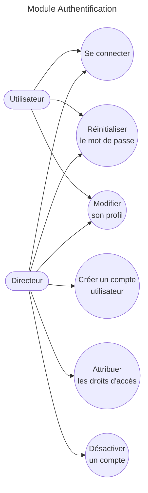

> **Note :** Le Directeur hérite des droits d'accès de base (connexion, réinitialisation, modification de profil) en plus de ses fonctions d'administration.

---

## 3.2 Module Intervention

Ce module est le cœur fonctionnel du système. Il couvre le cycle de vie complet d'une fiche d'intervention, depuis sa création jusqu'à sa clôture.

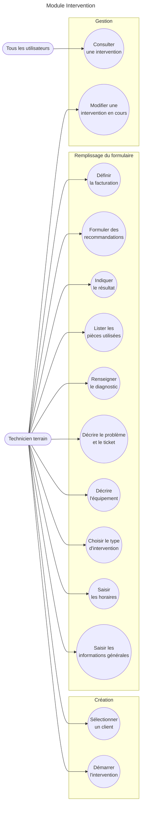

> **Note :** Une version enrichie avec relations `<<include>>` et `<<extend>>` (ex. : UC1 inclut UC2, UC10 peut étendre vers une intervention de suivi) sera produite en phase de conception détaillée.

---

## 3.3 Module Géolocalisation

Ce module permet la capture et la visualisation de la position géographique des interventions.

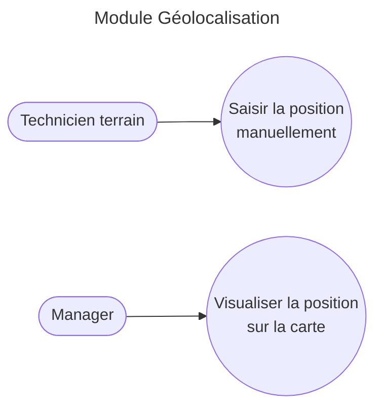

---

## 3.4 Module Photos

Ce module gère la capture et la gestion des photos avant et après intervention, avec horodatage et géolocalisation automatiques.

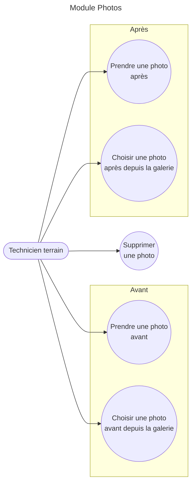

---

## 3.5 Module Signatures

Ce module gère la collecte des trois signatures électroniques requises pour valider une fiche d'intervention : client, technicien et responsable hiérarchique.

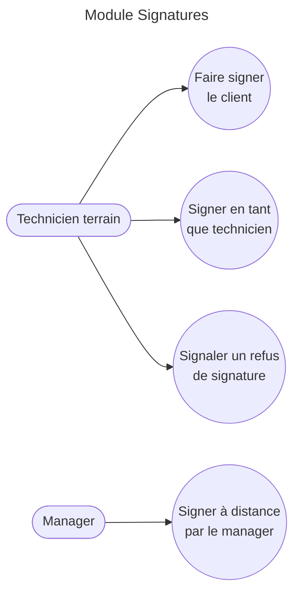

---

## 3.6 Module Mode Hors-ligne

Ce module garantit la continuité opérationnelle en l'absence de connexion réseau, avec synchronisation automatique au retour de la connectivité.

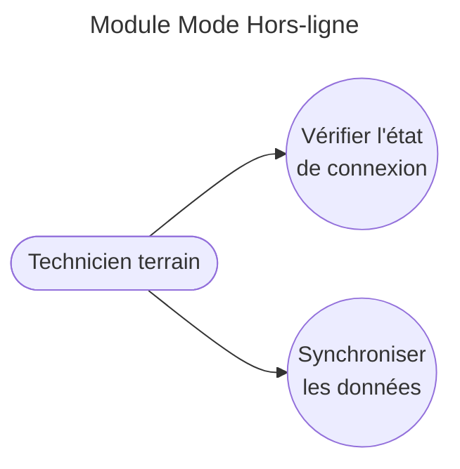

---

## 3.7 Module Rapport PDF

Ce module gère la génération et la mise à disposition du rapport PDF final de l'intervention, conforme à la charte graphique NG-STARs.

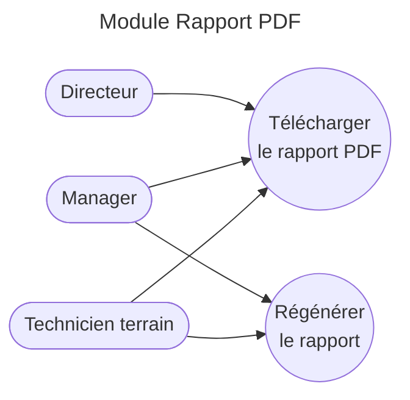

---

## 3.8 Module Envoi du Rapport

Ce module couvre les canaux de transmission du rapport PDF aux parties prenantes : email et WhatsApp.

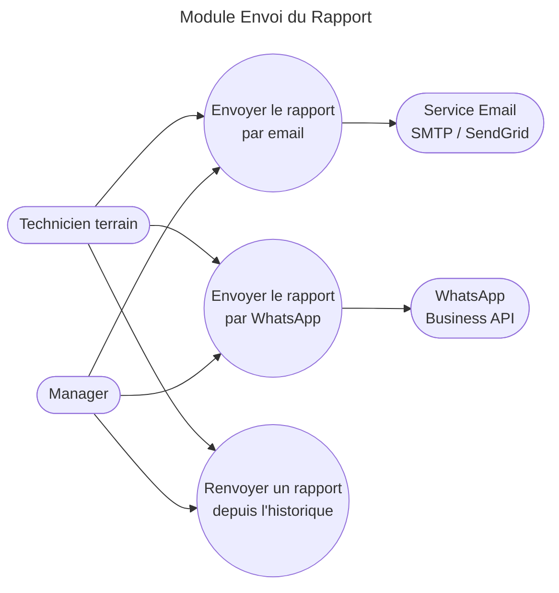

> **Acteurs secondaires :** SMTP/SendGrid et WhatsApp Business API sont des systèmes externes appelés par NG-Fields. Les flèches partent des cas d'utilisation vers ces services.

---

## 3.9 Module Clients

Ce module gère le référentiel clients : création, modification des fiches et consultation de l'historique des interventions associées.

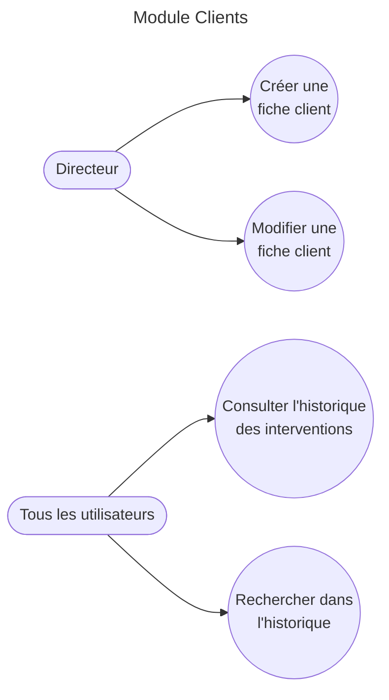

---

## 3.10 Module Notifications

Ce module gère les alertes automatiques émises aux étapes clés du cycle de vie des interventions, acheminées via le service push (FCM/APNs).

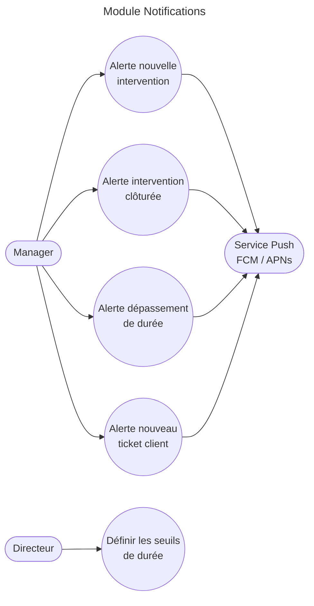

> **Acteur secondaire :** FCM/APNs est un service externe que NG-Fields appelle pour acheminer les notifications. Les flèches partent des cas d'utilisation vers ce service.

---

## 3.11 Module Tableau de Bord

Ce module offre au manager et au directeur une vue globale et filtrée de l'activité terrain, avec indicateurs KPI et capacité d'export.

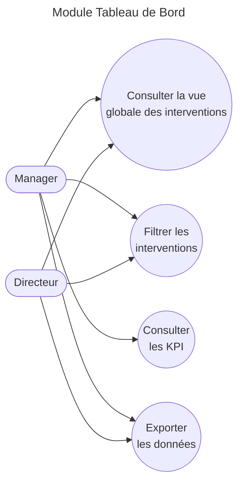

> **Note :** La consultation des KPI (UC3) est réservée au Manager. Le Directeur dispose de la vue globale et des exports, mais pas du tableau d'indicateurs opérationnels.

---

## 3.12 Module Planning

Ce module permet la planification, l'assignation et le suivi des interventions dans le temps, à destination des managers, directeurs et techniciens.

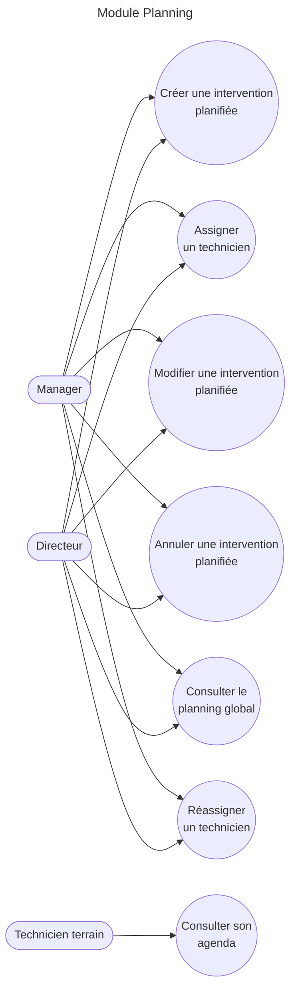

> **Note :** Le technicien terrain accède uniquement à la consultation de son propre agenda (UC5). La gestion du planning est réservée au Manager et au Directeur.

---

## 3.13 Module Rappels

Ce module permet à tous les utilisateurs de suivre les actions en attente et de les marquer comme traitées.

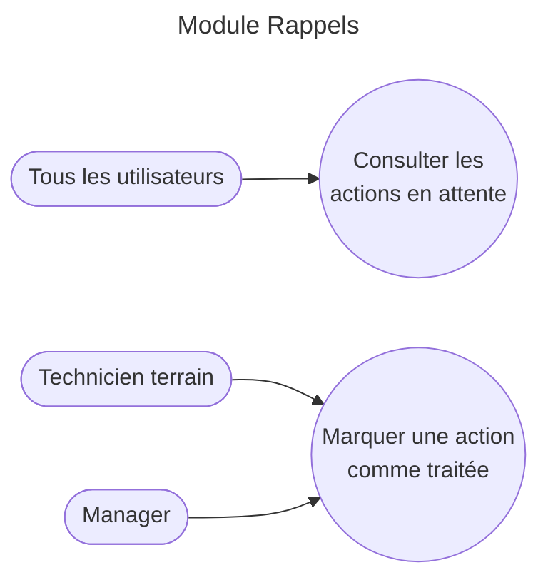

---

## 3.14 Module Portail Client & OpenProject

Ce module couvre le cycle de vie des tickets issus du portail client, depuis la soumission de la demande jusqu'à la planification des interventions associées.

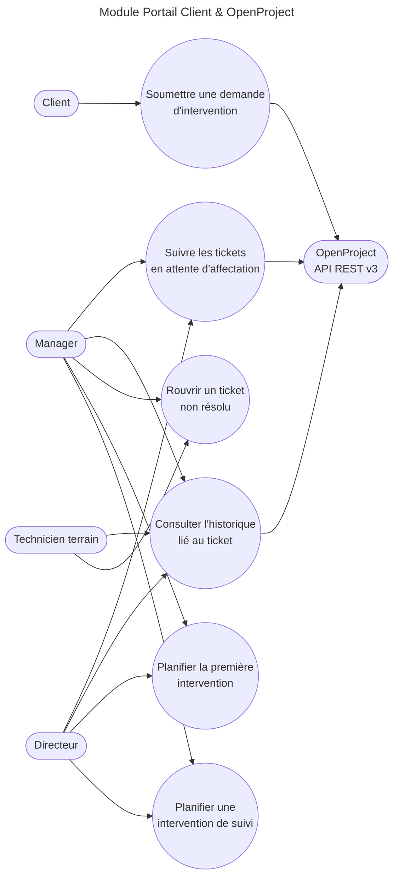

> **Corrections apportées :**
> 
> - UC3 (consulter l'historique) est maintenant accessible à **Manager, Directeur et Technicien terrain**, conformément au tableau de la section 2 (colonne Acteurs : « Tous »).
> - OpenProject est un acteur secondaire appelé par le système. Les flèches partent des cas d'utilisation vers OpenProject, et non l'inverse.

---

## 3.15 Vue globale synthétique des modules

Cette carte mentale offre une vue d'ensemble des 14 modules fonctionnels de l'application NG-Fields.

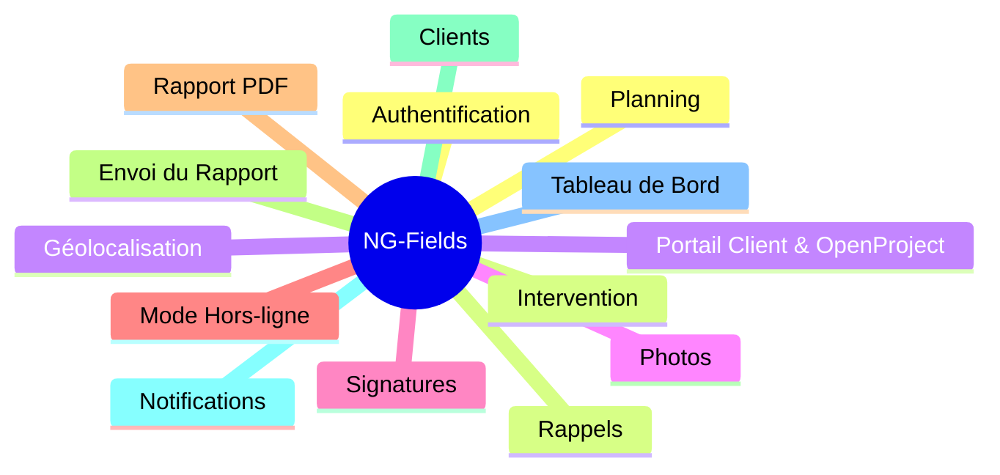

---

## Remarques et conventions

|Point|Détail|
|---|---|
|**Outil de rendu**|Les diagrammes sont compatibles Mermaid. Ils peuvent être rendus dans GitHub, GitLab, VS Code (extension Mermaid), Obsidian, Notion ou le [Mermaid Live Editor](https://mermaid.live/).|
|**Niveau de détail**|Les diagrammes représentent une vue simplifiée (niveau 1). Les relations `<<include>>` et `<<extend>>` seront formalisées dans la phase de conception détaillée, en priorité pour le module Intervention.|
|**Acteurs secondaires**|Les systèmes externes (SMTP, WhatsApp, FCM/APNs, OpenProject) figurent à droite des diagrammes, avec les flèches orientées **depuis les cas d'utilisation vers eux**, conformément à la convention UML des acteurs secondaires.|
|**Module Facturation**|Le module Facturation a été volontairement exclu du périmètre v1.0 (items barrés dans la section 2). Il pourra faire l'objet d'une itération ultérieure.|
|**Cohérence avec la section 2**|Tous les cas d'utilisation et acteurs de ce document sont alignés avec le tableau de la section 2 – Identification des cas d'utilisation. Toute divergence doit être signalée au validateur.|

---

_Document rédigé par FOLLY Nelson Emmanuel — Statut : Brouillon v1.0 — En attente de validation par David KATOH_