**Projet :** NG-Fields – Digitalisation de la gestion des interventions terrain 
**Référence CdC :** NG-STARs Cahier des Charges V3.2 – 18/05/2026
**Rédigé par :** FOLLY Nelson Emmanuel (Stagiaire) 
**Validateur :** David KATOH (Responsable IT)

---

## Sommaire

- [Introduction]
- [1. Identification des acteurs]
- [2. Identification des cas d'utilisation]
- [3. Diagrammes des cas d'utilisation par module]
- [4. Description textuelle des cas d'utilisation]
- [5. Diagrammes de classes]
- [6. Développement du modèle statique]
- [7. Développement du modèle dynamique]

---

## Introduction

La capture des besoins fonctionnels constitue une étape clé dans le processus de conception d'un système ou d'une application. Elle permet d'identifier, de structurer et de formaliser les attentes des utilisateurs et les fonctionnalités que le système devra proposer pour y répondre efficacement.

Ce document a pour objectif de décrire l'ensemble des fonctions que devra assurer le futur système NG-Fields, en se basant sur l'analyse des besoins exprimés par les parties prenantes de NG-STARs. Il servira de référence commune tout au long du cycle de développement, notamment lors des phases de modélisation, de conception et de validation.

En décrivant clairement les cas d'utilisation, les rôles des acteurs, et les interactions entre ces derniers et le système, cette documentation vise à garantir une compréhension partagée des objectifs fonctionnels et à limiter les risques d'ambiguïtés ou d'oublis.

---

## 1. Identification des acteurs

Les acteurs désignent toutes les entités qui interagissent avec le système sans en faire partie intégrante. Nous pouvons identifier deux types d'acteurs : primaires et secondaires.

Les acteurs primaires sont les éléments qui interagissent directement avec le système et les acteurs secondaires sont des éléments connexes faisant partie d'un autre système.

Nous pouvons identifier les acteurs suivants :

| ACTEUR                                     | FONCTION                                                                                                                                                           | TYPE D'ACTEUR |
| ------------------------------------------ | ------------------------------------------------------------------------------------------------------------------------------------------------------------------ | ------------- |
| Technicien terrain                         | Crée et remplit les fiches d'intervention numériques sur mobile. Capture les photos, collecte les signatures et soumet les rapports depuis le terrain.             | Primaire      |
| Manager                                    | Supervise les activités terrain via le tableau de bord web. Consulte les statistiques, reçoit les notifications en temps réel et appose la signature hiérarchique. | Primaire      |
| Directeur                                  | Configure et administre le système : gestion des comptes utilisateurs, des droits d'accès, des référentiels clients et des paramètres de notification.             | Primaire      |
| Client                                     | Saisit directement sa demande d'intervention depuis le portail client de l'application NG-Fields, déclenchant la création d'un ticket dans OpenProject.            | Primaire      |
| Service Email (SMTP / SendGrid)            | Reçoit les requêtes d'envoi et achemine les rapports PDF par email aux destinataires désignés.                                                                     | Secondaire    |
| WhatsApp Business API                      | Reçoit les requêtes d'envoi et transmet les rapports PDF via la messagerie WhatsApp aux clients.                                                                   | Secondaire    |
| Service de notifications Push (FCM / APNs) | Reçoit les déclencheurs d'événements et achemine les alertes push en temps réel vers les appareils mobiles des techniciens et managers.                            | Secondaire    |
| OpenProject                                | Héberge les tickets d'intervention créés via le portail client ou le formulaire NG-Fields. Met à disposition l'API REST v3 (création, mise à jour, consultation).  | Secondaire    |

---

## 2. Identification des cas d'utilisation

L'identification des cas d'utilisation constitue une étape clé dans la compréhension des besoins fonctionnels du système. Elle permet de modéliser les interactions entre les différents acteurs et le système à développer. Pour ce projet, chaque cas d'utilisation décrit un scénario fonctionnel répondant à un objectif précis pour un acteur donné. Cette démarche vise à structurer les principales fonctionnalités de la future application NG-Fields, tout en assurant une couverture complète des exigences exprimées dans le cahier des charges. Les cas d'utilisation identifiés serviront de base pour les spécifications détaillées, les tests, et la conception technique du système.

| MODULE                           | CAS D'UTILISATION GÉNÉRALISÉ  | CAS D'UTILISATION SPÉCIFIQUE                             | ACTEURS                                |
| -------------------------------- | ----------------------------- | -------------------------------------------------------- | -------------------------------------- |
| **Authentification**             | Compte utilisateur            | Se connecter                                             | Tous                                   |
|                                  |                               | Réinitialiser son mot de passe                           | Tous                                   |
|                                  |                               | Modifier son profil                                      | Tous                                   |
|                                  |                               | Créer un compte utilisateur                              | Directeur                              |
|                                  |                               | Attribuer les droits d'accès                             | Directeur                              |
|                                  |                               | Désactiver un compte                                     | Directeur                              |
| **Intervention**                 | Créer une intervention        | Démarrer une intervention                                | Technicien terrain                     |
|                                  |                               | Sélectionner un client                                   | Technicien terrain                     |
|                                  | Remplir le formulaire         | Saisir les informations générales                        | Technicien terrain                     |
|                                  |                               | Saisir les horaires                                      | Technicien terrain                     |
|                                  |                               | Choisir le type d'intervention                           | Technicien terrain                     |
|                                  |                               | Décrire l'équipement concerné                            | Technicien terrain                     |
|                                  |                               | Décrire le problème et le ticket OpenProject             | Technicien terrain                     |
|                                  |                               | Renseigner le diagnostic et les travaux                  | Technicien terrain                     |
|                                  |                               | Lister les pièces utilisées                              | Technicien terrain                     |
|                                  |                               | Indiquer le résultat                                     | Technicien terrain                     |
|                                  |                               | Formuler des recommandations                             | Technicien terrain                     |
|                                  |                               | Définir la facturation                                   | Technicien terrain                     |
|                                  | Modifier une intervention     | Modifier une intervention en cours                       | Technicien terrain                     |
|                                  |                               | Consulter une intervention                               | Tous                                   |
| **Géolocalisation**              | Localiser le site             | Saisir la position manuellement                          | Technicien terrain                     |
|                                  |                               | Visualiser la position sur la carte                      | Manager                                |
| **Photos**                       | Photographier avant           | Prendre une photo                                        | Technicien terrain                     |
|                                  |                               | Choisir une photo depuis la galerie                      | Technicien terrain                     |
|                                  | Photographier après           | Prendre une photo                                        | Technicien terrain                     |
|                                  |                               | Choisir une photo depuis la galerie                      | Technicien terrain                     |
|                                  | Gérer les photos              | Supprimer une photo                                      | Technicien terrain                     |
| **Signatures**                   | Signer sur site               | Faire signer le client                                   | Technicien terrain                     |
|                                  |                               | Signer en tant que technicien                            | Technicien terrain                     |
|                                  |                               | Signaler un refus de signature                           | Technicien terrain                     |
|                                  |                               | Signer à distance (manager)                              | Manager                                |
| **Mode hors-ligne**              | Travailler sans connexion     | Vérifier l'état de connexion                             | Technicien terrain                     |
|                                  |                               | Synchroniser les données                                 | Technicien terrain                     |
| **Rapport PDF**                  | Générer un rapport            | Télécharger le rapport PDF                               | Technicien terrain, Manager, Directeur |
|                                  |                               | Régénérer le rapport                                     | Technicien terrain, Manager            |
| **Envoi du rapport**             | Envoyer le rapport            | Envoyer le rapport par email                             | Technicien terrain, Manager, Service Email |
|                                  |                               | Envoyer le rapport par WhatsApp                          | Technicien terrain, Manager, WhatsApp Business API |
|                                  |                               | Renvoyer un rapport depuis l'historique                  | Technicien terrain, Manager            |
| **Clients**                      | Gérer les fiches client       | Créer une fiche client                                   | Directeur                              |
|                                  |                               | Modifier une fiche client                                | Directeur                              |
|                                  |                               | Consulter l'historique des interventions                 | Tous                                   |
|                                  |                               | Rechercher dans l'historique                             | Tous                                   |
| **Notifications**                | Recevoir une alerte           | Être alerté d'une nouvelle intervention                  | Manager, Service Push FCM/APNs         |
|                                  |                               | Être alerté d'une intervention clôturée                  | Manager, Service Push FCM/APNs         |
|                                  |                               | Être alerté d'un dépassement de durée                    | Manager, Service Push FCM/APNs         |
|                                  |                               | Être alerté d'un nouveau ticket client                   | Manager, Service Push FCM/APNs         |
|                                  | Paramétrer les alertes        | Définir les seuils de durée                              | Directeur                              |
| **Tableau de bord**              | Piloter l'activité            | Consulter la vue globale des interventions               | Manager, Directeur                     |
|                                  |                               | Filtrer les interventions                                | Manager, Directeur                     |
|                                  |                               | Consulter les indicateurs KPI                            | Manager                                |
|                                  |                               | Exporter les données                                     | Manager, Directeur                     |
| **Planning**                     | Planifier une intervention    | Créer une intervention planifiée                         | Manager, Directeur                     |
|                                  |                               | Assigner un technicien                                   | Manager, Directeur                     |
|                                  |                               | Modifier une intervention planifiée                      | Manager, Directeur                     |
|                                  |                               | Annuler une intervention planifiée                       | Manager, Directeur                     |
|                                  |                               | Consulter l'agenda d'un technicien                       | Technicien terrain                     |
|                                  |                               | Consulter le planning global                             | Manager, Directeur                     |
|                                  |                               | Réassigner un technicien                                 | Manager, Directeur                     |
| **Rappels**                      | Suivre les actions en attente | Consulter la liste des actions en attente                | Tous                                   |
|                                  |                               | Marquer une action comme traitée                         | Technicien terrain, Manager            |
| **Portail client & OpenProject** | Soumettre une demande         | Soumettre une demande d'intervention                     | Client, OpenProject                    |
|                                  | Gérer les tickets             | Suivre les tickets en attente d'affectation              | Manager, Directeur, OpenProject        |
|                                  |                               | Consulter l'historique des interventions liées au ticket | Tous, OpenProject                      |
|                                  |                               | Rouvrir un ticket non résolu                             | Technicien terrain, Manager            |
|                                  | Affecter un technicien        | Planifier la première intervention depuis le ticket      | Manager, Directeur                     |
|                                  |                               | Planifier une intervention de suivi                      | Manager, Directeur                     |
| ~~**Facturation**~~              | ~~Facturer une intervention~~ | ~~Créer une facture~~                                    | ~~Manager, Directeur~~                 |
|                                  |                               | ~~Envoyer la facture par email~~                         | ~~Manager, Directeur~~                 |
|                                  |                               | ~~Régénérer une facture~~                                | ~~Manager, Directeur~~                 |
|                                  |                               | ~~Mettre à jour le statut de paiement~~                  | ~~Manager, Directeur~~                 |
|                                  |                               | ~~Consulter le chiffre d'affaires~~                      | ~~Manager, Directeur~~                 |
|                                  |                               | ~~Alerte facture impayée~~                               | ~~Système~~                            |

---

## 3. Diagrammes des cas d'utilisation par module – NG-Fields

---

### 3.1 Diagramme – Module Authentification

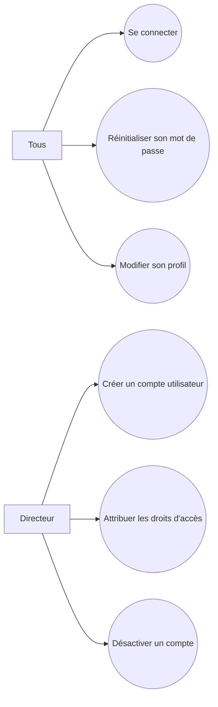

---

### 3.2 Diagramme – Module Intervention

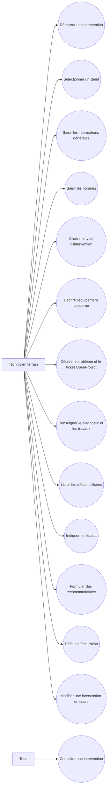

---

### 3.3 Diagramme – Module Géolocalisation

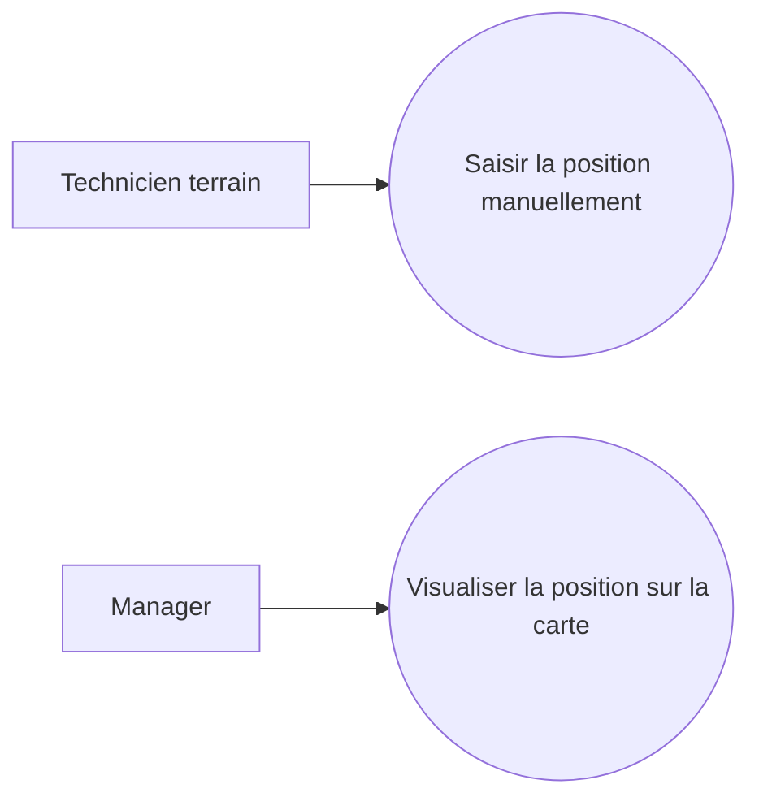

---

### 3.4 Diagramme – Module Photos

```mermaid
flowchart LR
    T[Technicien terrain]

    UC1((Prendre une photo (avant)))
    UC2((Choisir une photo depuis la galerie (avant)))
    UC3((Prendre une photo (après)))
    UC4((Choisir une photo depuis la galerie (après)))
    UC5((Supprimer une photo))

    T --> UC1
    T --> UC2
    T --> UC3
    T --> UC4
    T --> UC5
```

---

### 3.5 Diagramme – Module Signatures

```mermaid
flowchart LR
    T[Technicien terrain]
    M[Manager]

    UC1((Faire signer le client))
    UC2((Signer en tant que technicien))
    UC3((Signaler un refus de signature))
    UC4((Signer à distance (manager)))

    T --> UC1
    T --> UC2
    T --> UC3

    M --> UC4
```

---

### 3.6 Diagramme – Module Mode Hors-ligne

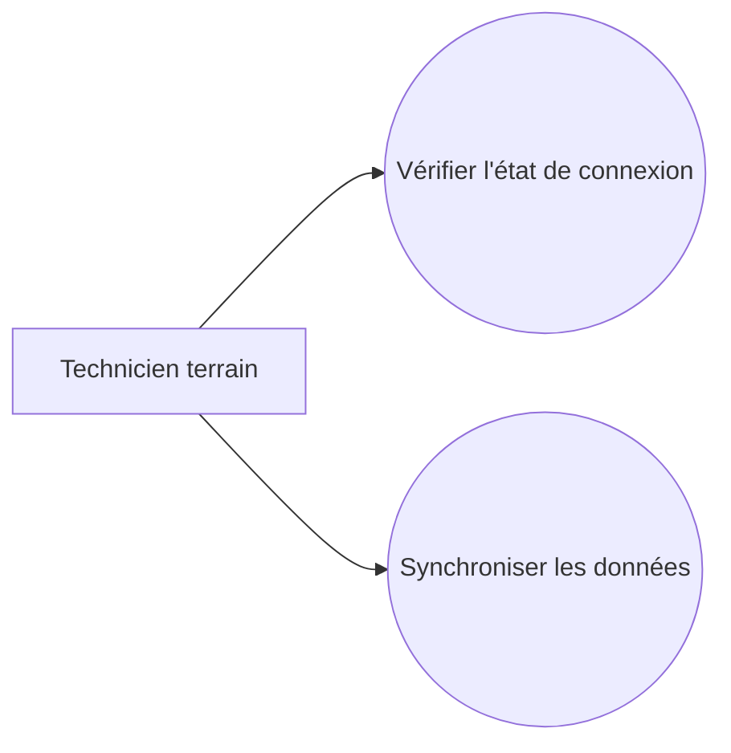

---

### 3.7 Diagramme – Module Rapport PDF

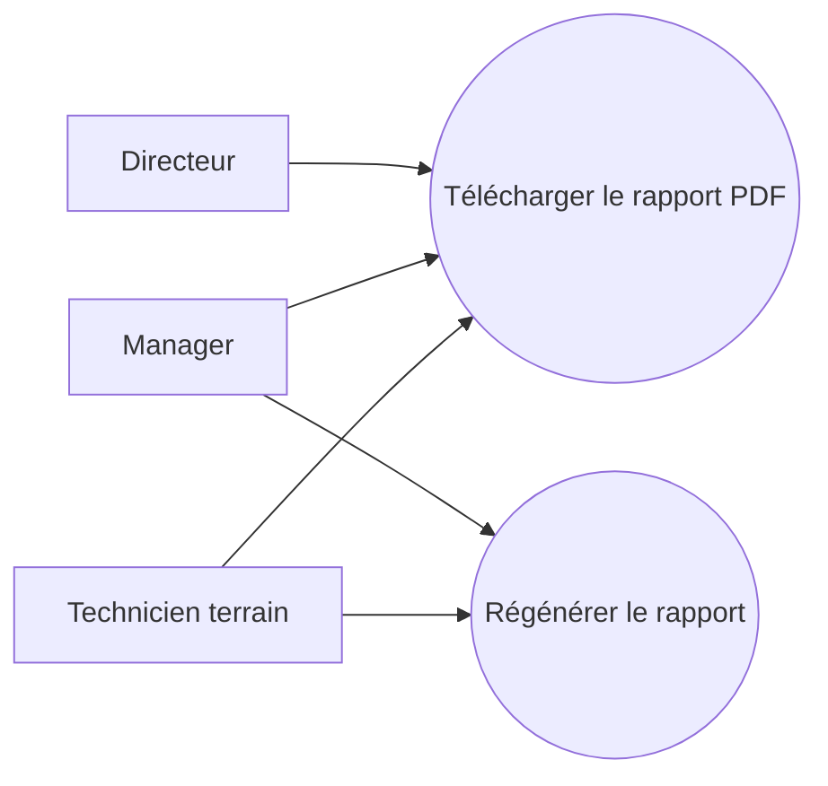

---

### 3.8 Diagramme – Module Envoi du Rapport

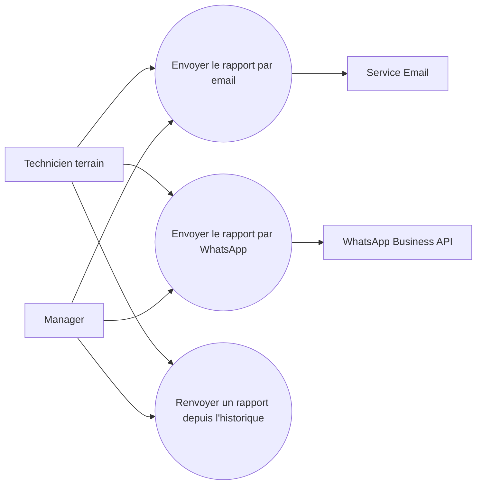

---

### 3.9 Diagramme – Module Clients

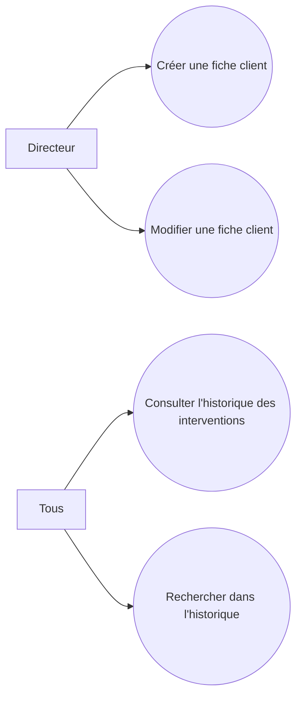

---

### 3.10 Diagramme – Module Notifications

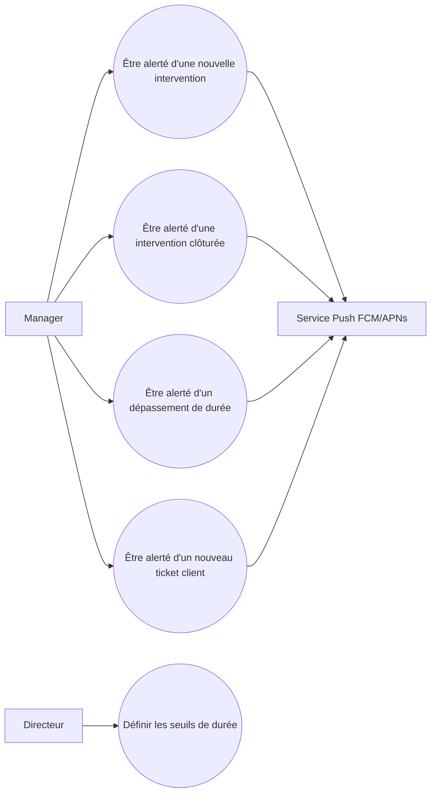

---

### 3.11 Diagramme – Module Tableau de Bord

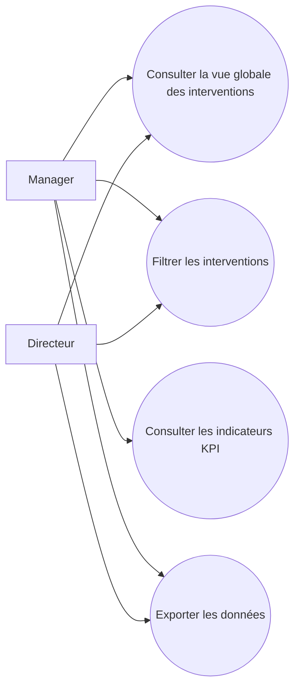

---

### 3.12 Diagramme – Module Planning

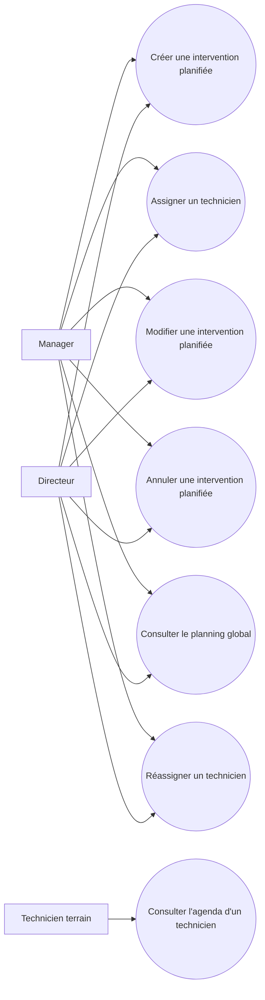

---

### 3.13 Diagramme – Module Rappels

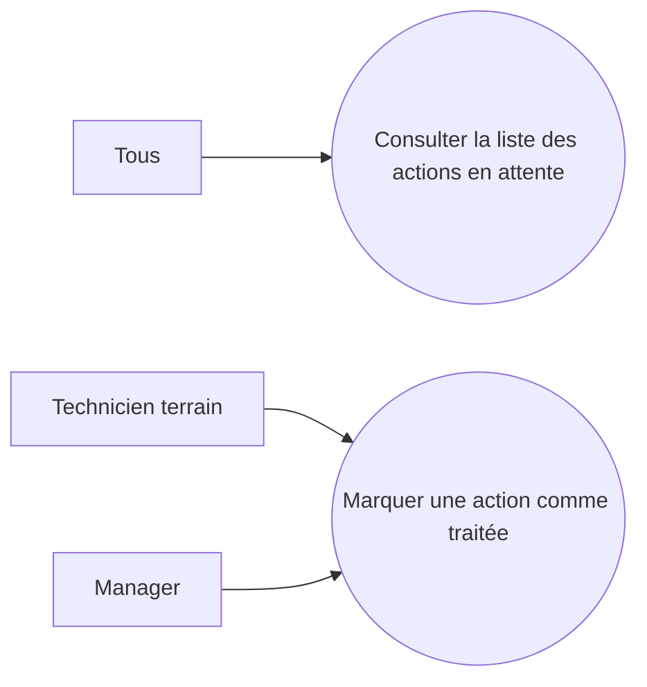

---

### 3.14 Diagramme – Module Portail Client & OpenProject

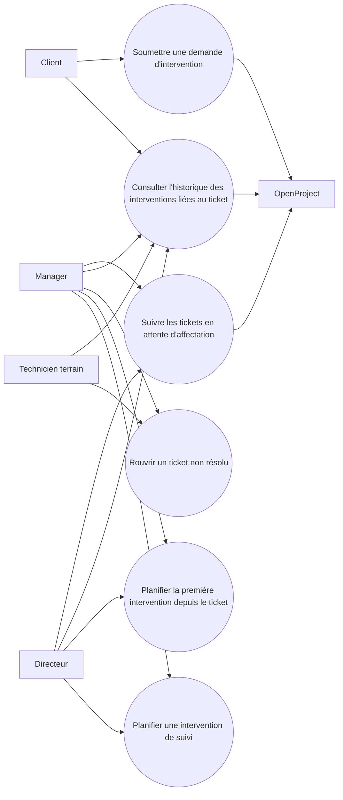

---

### 3.15 Vue globale synthétique des modules

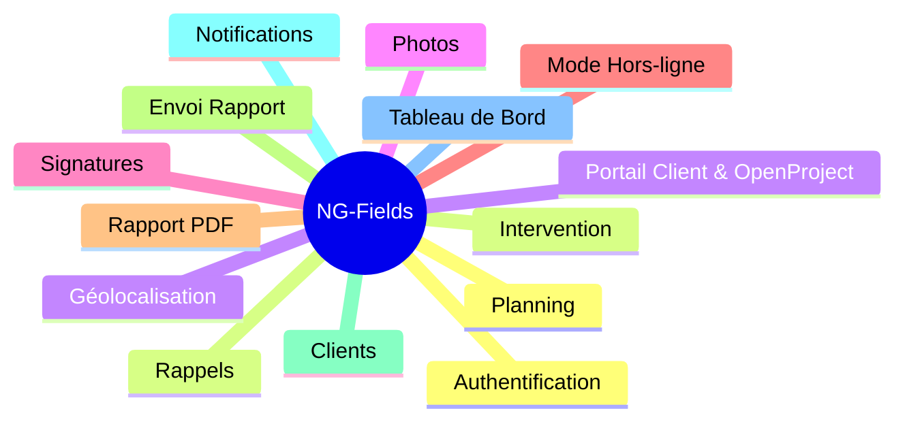

---

---
## 4. Description textuelle des cas d'utilisation

Une description textuelle de cas d'utilisation est un document rédigé en langage courant qui explique comment un utilisateur interagit avec un système pour accomplir un objectif spécifique. Elle détaille de manière organisée les acteurs concernés, les conditions nécessaires avant l'action, le déroulement principal du scénario, les éventuelles variantes, ainsi que les résultats attendus.

---

### Cas d'utilisation « Se connecter »

---

**SOMMAIRE D'IDENTIFICATION**

| **Titre**       | Se connecter                                                                                                                                              |
| --------------- | --------------------------------------------------------------------------------------------------------------------------------------------------------- |
| **Acteurs**     | Technicien terrain, Manager, Directeur                                                                                                                    |
| **Résumé**      | Ce cas d'utilisation permet à tout utilisateur de s'authentifier sur l'application NG-Fields afin d'accéder aux fonctionnalités correspondant à son rôle. |
| **Responsable** | FOLLY Nelson Emmanuel                                                                                                                                     |
| **Version**     | 1.0                                                                                                                                                       |
| **Date**        | 14/05/2026                                                                                                                                                |

**Description des scénarios**

**Préconditions :**
- L'application NG-Fields est installée et accessible.
- L'utilisateur dispose d'un compte actif créé par l'Directeur.
- Une connexion réseau est disponible (la connexion est obligatoire pour l'authentification initiale).
**Scénario nominal :**

1. L'utilisateur ouvre l'application NG-Fields sur son appareil.
2. Le système affiche l'écran de connexion avec les champs identifiant et mot de passe.
3. L'utilisateur saisit son identifiant et son mot de passe puis valide. (A1)
4. Le système vérifie les informations d'identification et génère un jeton JWT. (A2)
5. Le système redirige l'utilisateur vers l'écran d'accueil correspondant à son rôle (tableau de bord technicien ou manager).

**Scénarios alternatifs :**

- **A1 :** L'utilisateur soumet le formulaire avec un ou plusieurs champs vides.
    - Le système affiche un message d'erreur : « Veuillez remplir tous les champs. »
    - Le processus reprend au scénario 3.
- **A2 :** Les informations d'identification sont incorrectes.
    - Le système affiche un message d'erreur : « Identifiant ou mot de passe incorrect. »
    - Après 5 tentatives échouées, le compte est temporairement verrouillé et l'utilisateur reçoit un email de déblocage.
    - Le processus reprend au scénario nominal étape 3.

**Post-conditions :** L'utilisateur est authentifié et accède aux fonctionnalités selon son rôle.

---

### Cas d'utilisation « Créer une intervention »

---

**SOMMAIRE D'IDENTIFICATION**


| **Titre**       | Créer une intervention                                                                                                                                                                                                           |
| --------------- | -------------------------------------------------------------------------------------------------------------------------------------------------------------------------------------------------------------------------------- |
| **Acteurs**     | Technicien terrain                                                                                                                                                                                                               |
| **Résumé**      | Ce cas d'utilisation permet au technicien terrain de démarrer une nouvelle fiche d'intervention numérique depuis son application mobile, en renseignant les informations préalables et en déclenchant la capture GPS automatique |
| **Responsable** | FOLLY Nelson Emmanuel                                                                                                                                                                                                            |
| **Version**     | 1.0                                                                                                                                                                                                                              |
| **Date**        | 14/05/2026                                                                                                                                                                                                                       |


**Description des scénarios**

**Préconditions :**

- Le technicien est authentifié sur l'application mobile.
- L'application est opérationnelle (mode connecté ou hors-ligne).

**Scénario nominal :**

1. Le technicien appuie sur le bouton « Nouvelle Intervention » depuis l'écran d'accueil.
2. Le système crée une nouvelle fiche d'intervention avec un identifiant unique et enregistre la date et l'heure de début automatiquement.
3. Le système tente de capturer les coordonnées GPS de la position actuelle du technicien. (A1)
4. Le système enregistre les coordonnées GPS dans la section 1 de la fiche.
5. Le technicien sélectionne le client concerné depuis la liste ou crée une nouvelle fiche client. (A2)
6. Le technicien renseigne le type d'intervention, la priorité et la référence du ticket OpenProject.
7. Le système enregistre automatiquement les données saisies en local.
8. La fiche d'intervention passe au statut « En cours ».

**Scénarios alternatifs :**

- **A1 :** La localisation GPS est indisponible (permission refusée ou signal insuffisant).
    - Le système affiche un avertissement : « Position GPS non disponible. Vous pourrez la renseigner manuellement. »
    - Le processus reprend au scénario nominal étape 5.
- **A2 :** Le client n'est pas encore enregistré dans le système.
    - Le technicien appuie sur « Nouveau client » et renseigne les informations minimales (nom, adresse, contact).
    - Le système crée la fiche client localement et la synchronise au retour de la connectivité.
    - Le processus reprend au scénario nominal étape 6.

**Post-conditions :** Une nouvelle fiche d'intervention est créée, enregistrée localement avec un identifiant unique et le statut « En cours ».

---

### Cas d'utilisation « Remplir le formulaire d'intervention »

---

**SOMMAIRE D'IDENTIFICATION**

| **Titre**       | Remplir le formulaire d'intervention                                                                                                                                                                                                      |
| --------------- | ----------------------------------------------------------------------------------------------------------------------------------------------------------------------------------------------------------------------------------------- |
| **Acteurs**     | Technicien terrain                                                                                                                                                                                                                        |
| **Résumé**      | Ce cas d'utilisation décrit le remplissage complet du formulaire d'intervention FI-01-2025 par le technicien, couvrant les informations générales, client, horaires, équipement, diagnostic, pièces, résultat, facturation et signatures. |
| **Responsable** | FOLLY Nelson Emmanuel                                                                                                                                                                                                                     |
| **Version**     | 1.0                                                                                                                                                                                                                                       |
| **Date**        | 22/05/2026                                                                                                                                                                                                                                |

**Description des scénarios**

**Préconditions :**

- Le technicien est authentifié.
- Une fiche d'intervention a été créée et est au statut « En cours ».

**Scénario nominal :**

1. Le technicien ouvre la fiche d'intervention en cours.
2. Le système affiche le formulaire FI-01-2025 en 5 étapes avec navigation guidée.
3. Le technicien remplit les informations générales et client(intervenant, service, coordonnées client, contact site).
4. Le technicien saisit les horaires : sortie, arrivée, début, fin, retour (voir cas d'utilisation « Saisir les horaires »). (A1)
5. Le système calcule automatiquement la durée d'intervention.
6. Le technicien sélectionne le **type d'intervention** (Maintenance, Dépannage, Installation, Mise à jour, Audit/Contrôle, Autre).
7. Le technicien saisit l'**équipement concerné** (voir cas d'utilisation « Saisir le matériel et l'équipement concerné »).
8. Le technicien saisit la description du problème / N° ticket OpenProject, le diagnostic et les travaux réalisés.
9. Le technicien saisit les pièces et consommables utilisés (voir cas d'utilisation « Saisir les pièces et consommables utilisés »).
10. Le technicien choisit le résultat de l'intervention (voir cas d'utilisation « Choisir le résultat de l'intervention »). (A2)
11. Le technicien saisit les recommandations ou actions futures.
12. Le technicien configure la facturation (facturable Oui/Non, observations).
13. Le technicien capture les photos (voir cas d'utilisation « Photographier l'état avant/après intervention »).
14. Le système valide les champs obligatoires. (A3)
15. La fiche passe au statut « Terminer » et est prête pour la signature.

**Scénarios alternatifs :**

- **A1 :** L'heure de fin est antérieure à l'heure de début.
    - Le système affiche une erreur : « L'heure de fin ne peut pas précéder l'heure de début. »
    - Le processus reprend à l'étape 4.
- **A2 :** Le problème n'est pas résolu.
    - Le système propose de créer une intervention de suivi (voir cas d'utilisation « Créer une intervention de suivi »).
    - Le processus continue à l'étape 11.
- **A3 :** Un champ obligatoire est vide.
    - Le système affiche un message d'erreur sous le champ concerné : « Ce champ est obligatoire. »
    - Le processus ne progresse pas tant que le champ n'est pas renseigné.

**Post-conditions :** Toutes les sections du formulaire sont complétées, la durée d'intervention est calculée, le résultat est enregistré, et la fiche est au statut « Terminer » prête pour signature.

---

### Cas d'utilisation « Saisir une intervention sans connexion »

**SOMMAIRE D'IDENTIFICATION**

| **Titre**       | Saisir une intervention sans connexion                                                                                                                                                                                                                                           |
| --------------- | -------------------------------------------------------------------------------------------------------------------------------------------------------------------------------------------------------------------------------------------------------------------------------- |
| **Acteurs**     | Technicien terrain                                                                                                                                                                                                                                                               |
| **Résumé**      | Ce cas d'utilisation garantit que le technicien peut créer, remplir et clôturer une fiche d'intervention intégralement sans connexion réseau. Toutes les données sont stockées localement de manière chiffrée et synchronisées automatiquement dès le retour de la connectivité. |
| **Responsable** | FOLLY Nelson Emmanuel                                                                                                                                                                                                                                                            |
| **Version**     | 1.0                                                                                                                                                                                                                                                                              |
| **Date**        | 14/05/2026                                                                                                                                                                                                                                                                       |
**Description des scénarios**

**Préconditions :**

- Le technicien est authentifié (la session locale est active).
- L'appareil ne dispose d'aucune connexion réseau (mode hors-ligne détecté).
- La base de données locale chiffrée est opérationnelle sur l'appareil.

**Scénario nominal :**

1. Le système détecte l'absence de connexion réseau et affiche l'indicateur de statut en orange (hors-ligne).
2. Le technicien crée et remplit la fiche d'intervention normalement (formulaire, photos, GPS, signatures).
3. Le système enregistre toutes les données dans la base de données locale chiffrée à chaque étape
4. Le technicien clôture et valide la fiche d'intervention.
5. Le système place la fiche dans la file d'attente de synchronisation.
6. Le système détecte le retour de la connectivité réseau.
7. Le système affiche l'indicateur de statut en vert et déclenche automatiquement la synchronisation. (A1)
8. Le système envoie les données de la file d'attente au backend dans un délai maximum de 60 secondes.
9. Le backend confirme la réception et le système marque la fiche comme synchronisée.
10. L'indicateur de synchronisation affiche la confirmation à l'écran.

**Scénarios alternatifs :**

- **A1 :** La synchronisation échoue en raison d'un conflit de données (fiche modifiée depuis un autre appareil).
    - Le système détecte le conflit et applique la stratégie de résolution définie (dernière écriture prioritaire).
    - Le système journalise l'événement et notifie l'Directeur si le conflit ne peut pas être résolu automatiquement.
    - Le processus reprend à l'étape 8.

**Post-conditions :** La fiche d'intervention est synchronisée avec le backend, visible sur le tableau de bord manager, et le statut de l'indicateur réseau est au vert.

---

### Cas d'utilisation « Photographier »

---

**SOMMAIRE D'IDENTIFICATION**

| **Titre**       | Photographier                                                                                                                                                                                                                                                |
| --------------- | ------------------------------------------------------------------------------------------------------------------------------------------------------------------------------------------------------------------------------------------------------------ |
| **Acteurs**     | Technicien terrain                                                                                                                                                                                                                                           |
| **Résumé**      | Ce cas d'utilisation permet au technicien de capturer des photos avant et après l'intervention (5 maximum par catégorie), automatiquement géolocalisées et horodatées, afin de constituer une preuve visuelle intégrée dans la fiche et dans le rapport PDF. |
| **Responsable** | FOLLY Nelson Emmanuel                                                                                                                                                                                                                                        |
| **Version**     | 1.0                                                                                                                                                                                                                                                          |
| **Date**        | 14/05/2026                                                                                                                                                                                                                                                   |

**Description des scénarios**

**Préconditions :**

- Le technicien est authentifié.
- La fiche d'intervention est au statut « En cours ».
- La permission d'accès à l'appareil photo a été accordée par l'utilisateur.

**Scénario nominal :**

1. Le technicien accède à la Section 5 du formulaire d'intervention.
2. Le technicien appuie sur le bouton « Ajouter une photo » dans la catégorie souhaitée (avant ou après). (A1)
3. L'interface appareil photo de l'application s'ouvre.
4. Le technicien prend la photo et confirme. (A2)
5. Le système compresse automatiquement la photo (cible : ≤ 500 Ko) sans supprimer les métadonnées GPS et l'horodatage.
6. Le système enregistre la photo dans la base de données locale avec les coordonnées GPS et l'heure de capture.
7. La miniature de la photo apparaît dans la section correspondante du formulaire.
8. Le technicien peut répéter les étapes 2 à 7 jusqu'à 5 photos par catégorie. (A3)

**Scénarios alternatifs :**

- **A1 :** Le technicien souhaite sélectionner une photo depuis la galerie plutôt que de la prendre en direct.
    - Le système ouvre la galerie de l'appareil.
    - Le technicien sélectionne une image existante.
    - Le processus reprend au scénario nominal étape 5.
- **A2 :** Le technicien annule la prise de vue.
    - La photo n'est pas enregistrée.
    - Le processus reprend au scénario nominal étape 2.
- **A3 :** Le technicien tente d'ajouter une 6e photo dans une catégorie.
    - Le système affiche un message : « Limite atteinte. Vous ne pouvez pas ajouter plus de 5 photos par catégorie. »
    - Le bouton « Ajouter une photo » est désactivé pour la catégorie concernée.

**Post-conditions :** Les photos sont enregistrées localement avec leurs métadonnées (GPS, horodatage) et seront intégrées automatiquement dans le rapport PDF lors de sa génération.

---

### Cas d'utilisation « Signer »

---

**SOMMAIRE D'IDENTIFICATION**

| **Titre**       | Signer                                                                                                                                                                                                                                                                                                             |
| --------------- | ------------------------------------------------------------------------------------------------------------------------------------------------------------------------------------------------------------------------------------------------------------------------------------------------------------------ |
| **Acteurs**     | Technicien terrain (signature client et technicien), Manager                                                                                                                                                                                                                                                       |
| **Résumé**      | Ce cas d'utilisation permet de recueillir les trois signatures électroniques distinctes requises pour valider une fiche d'intervention : celle du client sur site, celle du technicien intervenant, et celle du responsable hiérarchique, cette dernière pouvant être apposée de manière différée depuis le bureau |
| **Responsable** | FOLLY Nelson Emmanuel                                                                                                                                                                                                                                                                                              |
| **Version**     | 1.0                                                                                                                                                                                                                                                                                                                |
| **Date**        | 14/05/2026                                                                                                                                                                                                                                                                                                         |

**Description des scénarios**

**Préconditions :**

- Le technicien est authentifié.
- Toutes les sections obligatoires du formulaire (Section 1 à 7) sont complétées.
- La fiche est au statut « Complétée ».

**Scénario nominal :**

1. Le technicien accède à la Section 8 – Signatures du formulaire.
2. Le système affiche trois zones de signature tactile distinctes : Client, Technicien et Responsable hiérarchique.
3. Le technicien tend l'appareil au client qui trace sa signature dans la zone « Signature Client » à l'aide du doigt ou du stylet. (A1)
4. Le client confirme sa signature en appuyant sur « Valider ».
5. Le technicien trace sa propre signature dans la zone « Signature Technicien ».
6. Le technicien confirme sa signature en appuyant sur « Valider ».
7. Le système enregistre les deux signatures sous forme d'images PNG encodées en base64 dans la fiche.
8. La zone « Signature Responsable » reste en attente (statut : « En attente de signature »). (A2)
9. Le manager, depuis le tableau de bord web ou l'application, ouvre la fiche concernée et appose sa signature dans la zone dédiée.
10. Le manager confirme en appuyant sur « Valider ».
11. Le système enregistre la signature du responsable et met à jour le statut de la fiche.
12. La fiche passe au statut « Validée » et déclenche la génération automatique du rapport PDF.

**Scénarios alternatifs :**

- **A1 :** Le client refuse de signer.
    - Le technicien coche la case « Client absent ou refus de signature » et renseigne le motif.
    - La zone de signature client reste vide mais la fiche peut tout de même progresser.
    - Le processus reprend au scénario nominal étape 5.
- **A2 :** Le manager souhaite signer immédiatement sur site.
    - Le technicien appelle le manager ou lui transmet l'appareil.
    - Le manager s'authentifie et appose sa signature directement.
    - Le processus reprend au scénario nominal étape 10.

**Post-conditions :** Les signatures (client et technicien au minimum) sont enregistrées de manière immuable dans la fiche. La signature du responsable peut être différée. Une fois les trois signatures présentes, le rapport PDF est généré automatiquement.

---

### Cas d'utilisation « Télécharger le rapport PDF »

---

**SOMMAIRE D'IDENTIFICATION**

| **Titre**       | Télécharger le rapport PDF                                                                                                                                                                    |
| --------------- | --------------------------------------------------------------------------------------------------------------------------------------------------------------------------------------------- |
| **Acteurs**     | Technicien terrain, Manager                                                                                                                                                                   |
| **Résumé**      | Ce cas d'utilisation permet au technicien ou au manager de télécharger le rapport PDF complet de l'intervention, incluant les données des sections, les photos, les signatures et le QR code. |
| **Responsable** | FOLLY Nelson Emmanuel                                                                                                                                                                         |
| **Version**     | 1.0                                                                                                                                                                                           |
| **Date**        | 14/05/2026                                                                                                                                                                                    |


**Description des scénarios**

**Préconditions :**

- La fiche d'intervention est au statut « Validée » (toutes les sections complétées et au minimum les signatures client et technicien présentes).
- Les données de la fiche sont synchronisées avec le backend.
- Les photos sont téléversées sur le serveur.

**Scénario nominal :**

1. Le système détecte le passage de la fiche au statut « Validée ».
2. Le système déclenche automatiquement la génération du rapport PDF côté serveur.
3. Le moteur de génération PDF assemble les éléments suivants dans un template NG-STARs :
    - Logo NG-STARs et entête au format de la charte graphique.
    - Identifiant unique de l'intervention.
    - Données des 8 sections du formulaire.
    - Photos avant et après intervention avec leurs métadonnées (GPS, horodatage).
    - Images des trois signatures.
    - QR code pointant vers l'URL de la fiche numérique sur le backend.
4. Le rapport PDF est généré en moins de 10 secondes.
5. Le système stocke le PDF sur le backend et le rend accessible en téléchargement.
6. Une notification est envoyée au technicien et au manager : « Le rapport PDF est prêt. »
7. Le technicien ou le manager peut télécharger le PDF depuis la fiche ou le tableau de bord. (A1)

**Scénarios alternatifs :**

- **A1 :** La génération échoue (données manquantes ou erreur serveur).
    - Le système affiche un message d'erreur sur la fiche : « La génération du rapport a échoué. Veuillez réessayer. »
    - Le système journalise l'erreur et notifie l'Directeur.
    - Le technicien ou le manager peut relancer manuellement la génération via le bouton « Régénérer le rapport ».

**Post-conditions :** Un rapport PDF complet, conforme à la charte graphique NG-STARs, est généré et disponible en téléchargement. Il est prêt à être envoyé au client.

---

### Cas d'utilisation « Envoyer le rapport par email »

---

**SOMMAIRE D'IDENTIFICATION**

| **Titre**       | Envoyer le rapport par email                                                                                                                                                                                                    |
| --------------- | ------------------------------------------------------------------------------------------------------------------------------------------------------------------------------------------------------------------------------- |
| **Acteurs**     | Technicien terrain, Manager                                                                                                                                                                                                     |
| **Résumé**      | Ce cas d'utilisation permet à l'utilisateur d'envoyer le rapport PDF d'intervention directement par email au client ou à toute autre partie prenante, depuis l'application, immédiatement après la validation de l'intervention |
| **Responsable** | FOLLY Nelson Emmanuel                                                                                                                                                                                                           |
| **Version**     | 1.0                                                                                                                                                                                                                             |
| **Date**        | 14/05/2026                                                                                                                                                                                                                      |

**Description des scénarios**

**Préconditions :**

- Le rapport PDF de l'intervention est généré et disponible.
- Une connexion réseau est disponible.
- Le service d'envoi email (SMTP / API externe) est opérationnel.

**Scénario nominal :**

1. L'utilisateur accède à la fiche d'intervention validée.
2. L'utilisateur appuie sur le bouton « Envoyer par email ».
3. Le système pré-remplit le champ destinataire avec l'adresse email du client issue de la fiche client. (A1)
4. L'utilisateur vérifie les informations, peut ajouter des destinataires supplémentaires et personnalise l'objet si nécessaire.
5. L'utilisateur appuie sur « Envoyer ». (A2)
6. Le système transmet la requête d'envoi au service email avec le PDF en pièce jointe.
7. Le service email achemine le message et retourne une confirmation d'envoi.
8. Le système affiche une confirmation à l'utilisateur : « Email envoyé avec succès. »
9. La date et l'heure d'envoi sont enregistrées dans l'historique de la fiche.

**Scénarios alternatifs :**

- **A1 :** Aucune adresse email n'est renseignée dans la fiche client.
    - Le champ destinataire reste vide.
    - L'utilisateur saisit manuellement l'adresse email du destinataire.
    - Le processus reprend au scénario nominal étape 4.
- **A2 :** L'envoi échoue en raison d'une erreur réseau ou du service email.
    - Le système place la requête d'envoi dans une file d'attente avec mécanisme de relance automatique (backoff exponentiel).
    - Le système affiche un message : « L'envoi a échoué. Une nouvelle tentative sera effectuée automatiquement. »

**Post-conditions :** Le rapport PDF a été transmis par email au(x) destinataire(s) dans un délai inférieur à 2 minutes. L'envoi est consigné dans l'historique de la fiche.

---

### Cas d'utilisation « Envoyer le rapport via WhatsApp »

---

**SOMMAIRE D'IDENTIFICATION**

| **Titre**       | Envoyer le rapport via WhatsApp                                                                                                                                                                               |
| --------------- | ------------------------------------------------------------------------------------------------------------------------------------------------------------------------------------------------------------- |
| **Acteurs**     | Technicien terrain, Manager                                                                                                                                                                                   |
| **Résumé**      | Ce cas d'utilisation permet à l'utilisateur de partager le rapport PDF d'intervention directement via WhatsApp, en transmettant au client un lien d'accès direct au document hébergé sur le serveur NG-Fields |
| **Responsable** | FOLLY Nelson Emmanuel                                                                                                                                                                                         |
| **Version**     | 1.0                                                                                                                                                                                                           |
| **Date**        | 14/05/2026                                                                                                                                                                                                    |


**Description des scénarios**

**Préconditions :**

- Le rapport PDF est généré et hébergé sur le backend.
- Une connexion réseau est disponible.
- L'intégration WhatsApp Business API est opérationnelle.

**Scénario nominal :**

1. L'utilisateur accède à la fiche d'intervention validée.
2. L'utilisateur appuie sur le bouton « Envoyer via WhatsApp ».
3. Le système récupère le numéro de téléphone du client depuis la fiche client et pré-remplit le champ destinataire. (A1)
4. Le système génère un lien d'accès direct et sécurisé vers le PDF hébergé sur le serveur.
5. L'utilisateur confirme l'envoi en appuyant sur « Envoyer ».
6. Le système transmet le message avec le lien via l'API WhatsApp Business.
7. Le client reçoit le message WhatsApp contenant le lien de téléchargement du rapport.
8. Le système affiche une confirmation à l'utilisateur : « Message WhatsApp envoyé avec succès. »
9. L'envoi est consigné dans l'historique de la fiche.

**Scénarios alternatifs :**

- **A1 :** Aucun numéro de téléphone n'est renseigné dans la fiche client.
    - L'utilisateur saisit manuellement le numéro du destinataire.
    - Le processus reprend au scénario nominal étape 4.
- **A2 :** L'API WhatsApp est indisponible.
    - Le système affiche un message : « L'envoi WhatsApp est temporairement indisponible. Veuillez utiliser l'envoi par email. »
    - Le processus bascule vers le cas d'utilisation « Envoyer le rapport par email ».

**Post-conditions :** Le client a reçu un message WhatsApp contenant un lien d'accès direct au rapport PDF. L'envoi est consigné dans l'historique de la fiche.

---

### Cas d'utilisation « Recevoir une alerte »

---

**SOMMAIRE D'IDENTIFICATION**

| **Titre**       | Recevoir une alerte                                                                                                                                                                                             |
| --------------- | --------------------------------------------------------------------------------------------------------------------------------------------------------------------------------------------------------------- |
| **Acteurs**     | Manager                                                                                                                                                                                                         |
| **Résumé**      | Ce cas d'utilisation décrit la réception par le manager d'alertes automatiques push et email aux étapes clés du cycle de vie d'une intervention : création, clôture, et dépassement du seuil de durée paramétré |
| **Responsable** | FOLLY Nelson Emmanuel                                                                                                                                                                                           |
| **Version**     | 1.0                                                                                                                                                                                                             |
| **Date**        | 14/05/2026                                                                                                                                                                                                      |

**Description des scénarios**

**Préconditions :**

- Le manager est authentifié et a accordé les permissions de notifications push.
- Le service de notifications push est opérationnel.
- Les seuils de durée d'alerte sont configurés par l'Directeur.

**Scénario nominal :**

1. Un événement déclencheur survient dans le système (création d'une intervention, clôture, ou durée dépassant le seuil). (A1)
2. Le backend génère une notification push et un email d'alerte à destination du manager concerné.
3. Le système transmet la notification push 
4. Le manager reçoit la notification push sur son appareil avec le résumé de l'événement (nom du technicien, client, durée si applicable).
5. Le manager appuie sur la notification.
6. L'application s'ouvre et affiche directement la fiche d'intervention concernée.

**Scénarios alternatifs :**

- **A1 :** Le manager est hors-ligne au moment de la notification.
    - La notification est mise en file d'attente par le service push.
    - Elle est livrée dès que le manager se reconnecte, dans un délai inférieur à 1 minute.
- **A2 :** L'envoi push échoue.
    - Le système bascule automatiquement sur l'envoi de la notification par email (canal de secours).

**Post-conditions :** Le manager a reçu une alerte en moins d'une minute et peut accéder directement à la fiche d'intervention depuis la notification.

---

### Cas d'utilisation « Consulter le tableau de bord »

---

**SOMMAIRE D'IDENTIFICATION**

| **Titre**       | Consulter le tableau de bord                                                                                                                                                                                                                         |
| --------------- | ---------------------------------------------------------------------------------------------------------------------------------------------------------------------------------------------------------------------------------------------------- |
| **Acteurs**     | Manager, Directeur                                                                                                                                                                                                                                   |
| **Résumé**      | Ce cas d'utilisation permet au manager d'accéder via navigateur web à une vue globale et filtrée de toutes les interventions, avec statistiques, indicateurs clés (dont le temps moyen sur site par technicien) et possibilité d'export des données. |
| **Responsable** | FOLLY Nelson Emmanuel                                                                                                                                                                                                                                |
| **Version**     | 1.0                                                                                                                                                                                                                                                  |
| **Date**        | 14/05/2026                                                                                                                                                                                                                                           |

**Description des scénarios**

**Préconditions :**

- Le manager est authentifié avec des droits de niveau manager ou administrateur.
- Le tableau de bord web est accessible depuis un navigateur (Chrome, Firefox, Edge, Safari).
- Des données d'intervention sont disponibles dans le système.

**Scénario nominal :**

1. Le manager ouvre son navigateur et accède à l'URL du tableau de bord NG-Fields.
2. Le système authentifie la session et charge la vue globale des interventions du jour.
3. Le tableau de bord affiche la liste des interventions avec pour chaque entrée : statut, technicien, client, heure de début, durée sur site et état de synchronisation.
4. Le manager applique des filtres selon ses besoins : plage de dates, technicien, client, type d'intervention ou statut. (A1)
5. Le système met à jour l'affichage en temps réel en fonction des filtres appliqués.
6. Le manager consulte les indicateurs clés affichés en haut du tableau de bord : nombre d'interventions du jour, temps moyen sur site par technicien, interventions en retard.
7. Le manager appuie sur une intervention pour consulter le détail complet de la fiche et télécharger le rapport PDF si disponible. (A2)

**Scénarios alternatifs :**

- **A1 :** Aucune intervention ne correspond aux critères de filtre sélectionnés.
    - Le système affiche un message : « Aucune intervention trouvée pour les critères sélectionnés. »
    - Le manager peut réinitialiser les filtres.
- **A2 :** Le manager souhaite exporter les données filtrées.
    - Le manager appuie sur le bouton « Exporter » et choisit le format (CSV ou Excel).
    - Le système génère le fichier côté serveur et le propose en téléchargement.

**Post-conditions :** Le manager dispose d'une vue à jour et filtrée de toutes les interventions, avec accès aux KPI et aux exports de données.

---

### Cas d'utilisation « Consulter l'historique d'un client »

**SOMMAIRE D'IDENTIFICATION**

| **Titre**       | Consulter l'historique d'un client                                                                                                                                                                                       |
| --------------- | ------------------------------------------------------------------------------------------------------------------------------------------------------------------------------------------------------------------------ |
| **Acteurs**     | Technicien terrain, Manager, Directeur                                                                                                                                                                                   |
| **Résumé**      | Ce cas d'utilisation permet à tout utilisateur autorisé de consulter la fiche d'un client et l'ensemble des interventions qui lui ont été associées, avec recherche avancée par date, type d'intervention ou technicien. |
| **Responsable** | FOLLY Nelson Emmanuel                                                                                                                                                                                                    |
| **Version**     | 1.0                                                                                                                                                                                                                      |
| **Date**        | 14/05/2026                                                                                                                                                                                                               |

**Description des scénarios**

**Préconditions :**

- L'utilisateur est authentifié.
- Le client existe dans le référentiel et a au moins une intervention enregistrée.

**Scénario nominal :**

1. L'utilisateur navigue vers la section « Clients » de l'application ou du tableau de bord.
2. L'utilisateur recherche le client par nom, adresse ou référence.
3. Le système affiche la liste des clients correspondant à la recherche. (A1)
4. L'utilisateur sélectionne le client souhaité.
5. Le système affiche la fiche client avec ses informations (nom, adresse, contacts) et la liste de toutes ses interventions par ordre chronologique inverse.
6. L'utilisateur applique des filtres de recherche dans l'historique : par plage de dates, type d'intervention ou technicien ayant réalisé la prestation. (A2)
7. Le système actualise la liste des interventions selon les filtres.
8. L'utilisateur sélectionne une intervention pour en consulter le détail complet et accéder au rapport PDF associé.

**Scénarios alternatifs :**

- **A1 :** Aucun client ne correspond à la recherche.
    - Le système affiche un message : « Aucun client trouvé. »
    - L'utilisateur peut élargir les critères de recherche ou créer une nouvelle fiche client (si son rôle le permet).
- **A2 :** Aucune intervention ne correspond aux filtres appliqués dans l'historique.
    - Le système affiche un message : « Aucune intervention trouvée pour ces critères. »
    - L'utilisateur peut réinitialiser les filtres.

**Post-conditions :** L'utilisateur a accès à l'historique complet et filtré des interventions du client sélectionné, avec possibilité de consulter chaque fiche et son rapport PDF.

---

### Cas d'utilisation « Saisir les horaires »

---

**SOMMAIRE D'IDENTIFICATION**

| **Titre**       | Saisir les horaires                                                                                                                                                                                                   |
| --------------- | --------------------------------------------------------------------------------------------------------------------------------------------------------------------------------------------------------------------- |
| **Acteurs**     | Technicien terrain                                                                                                                                                                                                    |
| **Résumé**      | Ce cas d'utilisation permet au technicien de renseigner les 5 étapes horaires de l'intervention (sortie, arrivée, début, fin, retour) pour calculer automatiquement la durée totale passée sur site et en déplacement |
| **Responsable** | FOLLY Nelson Emmanuel                                                                                                                                                                                                 |
| **Version**     | 1.0                                                                                                                                                                                                                   |
| **Date**        | 22/05/2026                                                                                                                                                                                                            |

**Préconditions :**
- Le technicien est authentifié et a créé une fiche d'intervention.
- La fiche est au statut « En cours ».

**Scénario nominal :**
1. Le technicien accède à la section « Date et horaires » du formulaire.
2. Le système affiche les 5 champs horaires au format HH:mm : Sortie société, Arrivée client, Début intervention, Fin intervention, Retour société.
3. Le technicien saisit l'heure de sortie de la société. (A1)
4. Le technicien saisit l'heure d'arrivée chez le client.
5. Le technicien saisit l'heure de début d'intervention.
6. Le technicien saisit l'heure de fin d'intervention.
7. Le technicien saisit l'heure de retour à la société.
8. Le système calcule automatiquement la durée totale d'intervention (fin - début) et l'affiche. (A2)
9. Le système enregistre les horaires dans la fiche locale.

**Scénarios alternatifs :**
- **A1 :** Le technicien saisit un format invalide.
    - Le système affiche une erreur : « Format attendu : HH:mm (ex: 14:30). »
    - Le processus reprend à l'étape 3.
- **A2 :** L'heure de fin est antérieure à l'heure de début.
    - Le système affiche une alerte : « L'heure de fin ne peut pas précéder l'heure de début. »
    - Le processus reprend à l'étape 6.

**Post-conditions :** Les 5 horaires sont enregistrés et la durée totale est calculée et affichée.

---

### Cas d'utilisation « Décrire l'équipement concerné »

---

**SOMMAIRE D'IDENTIFICATION**

| **Titre**       | Décrire l'équipement concerné                                                                                                                                                                |
| --------------- | -------------------------------------------------------------------------------------------------------------------------------------------------------------------------------------------- |
| **Acteurs**     | Technicien terrain                                                                                                                                                                           |
| **Résumé**      | Ce cas d'utilisation permet au technicien de décrire le matériel, le système ou l'équipement sur lequel porte l'intervention : type, marque/modèle, numéro de série/version et localisation. |
| **Responsable** | FOLLY Nelson Emmanuel                                                                                                                                                                        |
| **Version**     | 1.0                                                                                                                                                                                          |
| **Date**        | 22/05/2026                                                                                                                                                                                   |

**Préconditions :**
- Le technicien est authentifié.
- La fiche d'intervention est en cours de remplissage.

**Scénario nominal :**
1. Le technicien accède à la section « Matériel / Système concerné » du formulaire.
2. Le système affiche les champs : Type de matériel, Marque/Modèle, N° série/Version, Localisation.
3. Le technicien renseigne le type de matériel ou logiciel concerné. (A1)
4. Le technicien renseigne la marque et le modèle.
5. Le technicien renseigne le numéro de série ou la version.
6. Le technicien renseigne la localisation de l'équipement.
7. Le système enregistre les informations dans la fiche.

**Scénarios alternatifs :**
- **A1 :** L'intervention ne concerne pas un équipement spécifique (ex: conseil, audit).
    - Les champs matériel restent vides et ne sont pas obligatoires.
    - Le processus passe à la section suivante.

**Post-conditions :** Les informations matériel/équipement sont enregistrées dans la fiche d'intervention.

---

### Cas d'utilisation « Lister les pièces utilisées »

---

**SOMMAIRE D'IDENTIFICATION**

| **Titre**       | Lister les pièces utilisées                                                                                                                                                                 |
| --------------- | ------------------------------------------------------------------------------------------------------------------------------------------------------------------------------------------- |
| **Acteurs**     | Technicien terrain                                                                                                                                                                          |
| **Résumé**      | Ce cas d'utilisation permet au technicien de lister les pièces détachées et consommables utilisés lors de l'intervention, en texte libre, pour constituer la base des éléments facturables. |
| **Responsable** | FOLLY Nelson Emmanuel                                                                                                                                                                       |
| **Version**     | 1.0                                                                                                                                                                                         |
| **Date**        | 22/05/2026                                                                                                                                                                                  |

**Préconditions :**
- Le technicien est authentifié.
- La fiche d'intervention est en cours de remplissage.

**Scénario nominal :**
1. Le technicien accède à la section « Pièces / Consommables utilisés » du formulaire.
2. Le système affiche une zone de texte libre multi-lignes.
3. Le technicien saisit la liste des pièces et consommables avec quantités si nécessaire.
4. Le système enregistre les données dans la fiche locale.
5. Les éléments saisis seront intégrés dans la section facturation et le rapport PDF.

**Post-conditions :** La liste des pièces et consommables est enregistrée dans la fiche d'intervention.

---

### Cas d'utilisation « Indiquer le résultat »

---

**SOMMAIRE D'IDENTIFICATION**

| **Titre**       | Indiquer le résultat                                                                                                                                                            |
| --------------- | ------------------------------------------------------------------------------------------------------------------------------------------------------------------------------- |
| **Acteurs**     | Technicien terrain                                                                                                                                                              |
| **Résumé**      | Ce cas d'utilisation permet au technicien d'indiquer le résultat final de l'intervention parmi trois options prédéfinies : problème résolu, partiellement résolu ou non résolu. |
| **Responsable** | FOLLY Nelson Emmanuel                                                                                                                                                           |
| **Version**     | 1.0                                                                                                                                                                             |
| **Date**        | 22/05/2026                                                                                                                                                                      |

**Préconditions :**
- Le technicien a renseigné les travaux réalisés.
- La fiche d'intervention est en cours de remplissage.

**Scénario nominal :**
1. Le technicien accède à la section « Résultat de l'intervention » du formulaire.
2. Le système affiche les 3 options sous forme de boutons radio.
3. Le technicien sélectionne une option : « Problème résolu », « Partiellement résolu » ou « Non résolu ». (A1)
4. Le système enregistre le résultat dans la fiche.
5. Si « Non résolu », le système propose de créer automatiquement un ticket de suivi dans OpenProject.

**Scénarios alternatifs :**
- **A1 :** Le technicien ne sélectionne aucune option et tente de passer à la section suivante.
    - Le système affiche un message : « Veuillez indiquer le résultat de l'intervention. »
    - Le processus ne progresse pas.

**Post-conditions :** Le résultat est enregistré et conditionne les actions suivantes (création ticket suivi si non résolu, validation, génération PDF).

---

### Cas d'utilisation « Soumettre une demande d'intervention »

---

**SOMMAIRE D'IDENTIFICATION**

| **Titre**       | Soumettre une demande d'intervention                                                                                                                                                              |
| --------------- | ------------------------------------------------------------------------------------------------------------------------------------------------------------------------------------------------- |
| **Acteurs**     | Client                                                                                                                                                                                            |
| **Résumé**      | Ce cas d'utilisation permet à un client NG-Fields de saisir directement une demande d'intervention depuis le portail client. La soumission crée un ticket dans OpenProject et notifie le manager. |
| **Responsable** | FOLLY Nelson Emmanuel                                                                                                                                                                             |
| **Version**     | 1.0                                                                                                                                                                                               |
| **Date**        | 22/05/2026                                                                                                                                                                                        |

**Préconditions :**
- Le client dispose d'un lien sécurisé ou d'un accès au portail client NG-Fields.
- Le backend NG-Fields est opérationnel.
- La connexion à OpenProject est configurée.

**Scénario nominal :**
1. Le client accède au portail client via un lien sécurisé (email, QR code, site web).
2. Le système affiche un formulaire simplifié de demande d'intervention.
3. Le client renseigne ses coordonnées : nom, email, téléphone. (A1)
4. Le client sélectionne la nature du problème / type d'intervention souhaitée.
5. Le client rédige une description libre de sa demande.
6. Le client indique le niveau d'urgence : Faible, Moyen ou Élevé.
7. Le client valide en cliquant sur « Envoyer ma demande ». (A2)
8. Le système reçoit la demande et crée automatiquement un ticket dans OpenProject avec :
    - Titre généré à partir du type et du nom client
    - Description libre saisie par le client
    - Priorité selon le niveau d'urgence
    - Statut initial : « Nouveau »
    - Projet cible configuré
9. Le système envoie un email de confirmation au client avec le numéro de ticket OpenProject. (A3)
10. Le système notifie le manager : « Nouveau ticket client reçu — en attente d'affectation. »
11. Le ticket apparaît dans la file d'attente du tableau de bord manager, statut « Non affecté ».
12. **Le processus d'affectation relève du manager** (voir cas d'utilisation « Affecter un technicien »).

**Scénarios alternatifs :**
- **A1 :** Le client est déjà connu dans le système (email existant).
    - Le système pré-remplit les coordonnées automatiquement.
    - Le processus reprend à l'étape 4.
- **A2 :** Des champs obligatoires sont vides.
    - Le système affiche un message d'erreur sous chaque champ manquant.
    - Le processus reprend à l'étape 3.
- **A3 :** OpenProject est temporairement indisponible.
    - Le système place la demande dans une file d'attente.
    - Le système renvoie un accusé : « Votre demande a bien été enregistrée. Elle sera traitée sous peu. »
    - La création du ticket est tentée automatiquement jusqu'à succès (retry avec backoff exponentiel) dans un délai max de 24h.

**Post-conditions :** Un ticket OpenProject est créé (immédiatement ou en différé), le client reçoit un numéro de suivi, le manager est notifié, le ticket est en file d'attente d'affectation.

---

### Cas d'utilisation « Affecter un technicien »

---

**SOMMAIRE D'IDENTIFICATION**

| **Titre**       | Affecter un technicien                                                                                                                                                                                  |
| --------------- | ------------------------------------------------------------------------------------------------------------------------------------------------------------------------------------------------------- |
| **Acteurs**     | Manager, Directeur                                                                                                                                                                                      |
| **Résumé**      | Ce cas d'utilisation permet au manager de consulter les tickets en attente, vérifier le planning des techniciens disponibles, affecter un technicien, et créer la première intervention liée au ticket. |
| **Responsable** | FOLLY Nelson Emmanuel                                                                                                                                                                                   |
| **Version**     | 1.0                                                                                                                                                                                                     |
| **Date**        | 22/05/2026                                                                                                                                                                                              |

**Préconditions :**
- Un ticket OpenProject existe avec le statut « Nouveau » ou « En attente d'affectation ».
- Le manager est authentifié sur le tableau de bord.

**Scénario nominal :**
1. Le manager reçoit une notification : « Nouveau ticket client à affecter. »
2. Le manager ouvre le tableau de bord et consulte la file d'attente des tickets non affectés. (A1)
3. Le système affiche pour chaque ticket : client, type de problème, urgence, date de soumission.
4. Le manager sélectionne un ticket et consulte les détails de la demande client.
5. Le manager vérifie le planning des techniciens disponibles. (A2)
6. Le manager sélectionne un technicien et confirme l'affectation.
7. Le système crée une intervention liée au ticket avec :
    - Statut initial : « Planifiée »
    - Technicien assigné
    - Client et problème repris du ticket
    - Date/heure selon planning
8. Le système notifie le technicien : « Nouvelle mission assignée — [client] — [date]. »
9. Le système met à jour le statut du ticket OpenProject : « En cours ».
10. Le ticket et l'intervention sont désormais liés (relation 1 ticket → N interventions possibles).

**Scénarios alternatifs :**
- **A1 :** Aucun ticket en attente.
    - Le système affiche : « Aucun ticket en attente d'affectation. »
- **A2 :** Aucun technicien disponible (planning saturé ou hors horaires).
    - Le système marque le ticket « En attente — planning complet ».
    - Le manager peut programmer une affectation ultérieure.
    - Le processus reprend à l'étape 5 dès qu'un créneau se libère.

**Post-conditions :** Un technicien est affecté, une intervention planifiée est créée, le ticket OpenProject est lié à l'intervention.

---

### Cas d'utilisation « Planifier une intervention de suivi »

---

**SOMMAIRE D'IDENTIFICATION**

| **Titre**       | Planifier une intervention de suivi                                                                                                                                                                         |
| --------------- | ----------------------------------------------------------------------------------------------------------------------------------------------------------------------------------------------------------- |
| **Acteurs**     | Manager, Directeur                                                                                                                                                                                          |
| **Résumé**      | Ce cas d'utilisation permet de créer une nouvelle intervention liée au même ticket OpenProject lorsque le problème n'a pas été résolu lors de la précédente intervention (résultat = Partiellement ou Non). |
| **Responsable** | FOLLY Nelson Emmanuel                                                                                                                                                                                       |
| **Version**     | 1.0                                                                                                                                                                                                         |
| **Date**        | 22/05/2026                                                                                                                                                                                                  |

**Préconditions :**
- Une intervention existe avec le statut « Terminée ».
- Le résultat de l'intervention est « Partiellement résolu » ou « Non résolu ».
- Le ticket OpenProject correspondant est toujours ouvert.

**Scénario nominal :**
1. Le technicien clôture l'intervention avec le résultat « Partiellement résolu » ou « Non résolu ». (A1)
2. Le système détecte que le problème n'est pas résolu et propose au manager de planifier une intervention de suivi.
3. Le manager reçoit une notification : « Intervention non résolue — [client] — suivi requis. »
4. Le manager ouvre le ticket OpenProject et consulte l'historique des interventions déjà réalisées.
5. Le manager sélectionne un technicien (même ou différent) et planifie une nouvelle intervention de suivi.
6. Le système crée une nouvelle intervention liée au même ticket OpenProject.
7. Le système conserve la liaison : 1 ticket → 2 interventions (et ainsi de suite jusqu'à résolution).
8. Le système notifie le technicien de la nouvelle intervention de suivi.

**Scénarios alternatifs :**
- **A1 :** Le technicien avait indiqué « Problème résolu » mais le client rapporte que le problème persiste.
    - Le client soumet une nouvelle demande via le portail (nouveau ticket) ou contacte le manager.
    - Le manager peut rouvrir le ticket précédent et créer une intervention de suivi.
    - Le processus reprend à l'étape 4.

**Post-conditions :** Une nouvelle intervention de suivi est créée et liée au ticket existant. Le même ticket OpenProject peut référencer N interventions jusqu'à résolution complète.

---


## 5. Identification des classes candidates

Après avoir identifié les acteurs ainsi que les cas d'utilisation et rédigé leurs descriptions textuelles, la prochaine étape consiste à amorcer la modélisation orientée objet. Cela passe par l'identification des premières classes candidates et la construction des diagrammes de classes associés. Ces classes initiales doivent représenter des concepts familiers aux utilisateurs du système. Pour chaque cas d'utilisation décrit en section 4, nous avons identifié les classes pertinentes et élaboré les diagrammes de classes correspondants. Cette modélisation nous permet de poser les bases structurelles du système en visualisant les entités principales et leurs relations.

---

**Se connecter :**

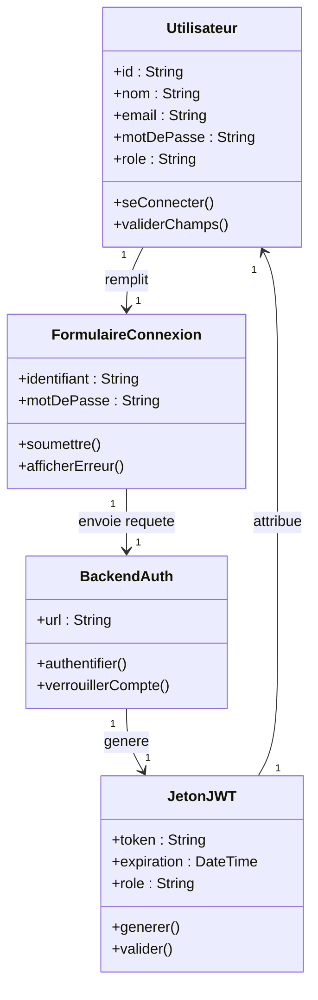

_Figure 1 : Diagramme de classes candidates du cas d'utilisation Se connecter_

---

**Créer une intervention :**

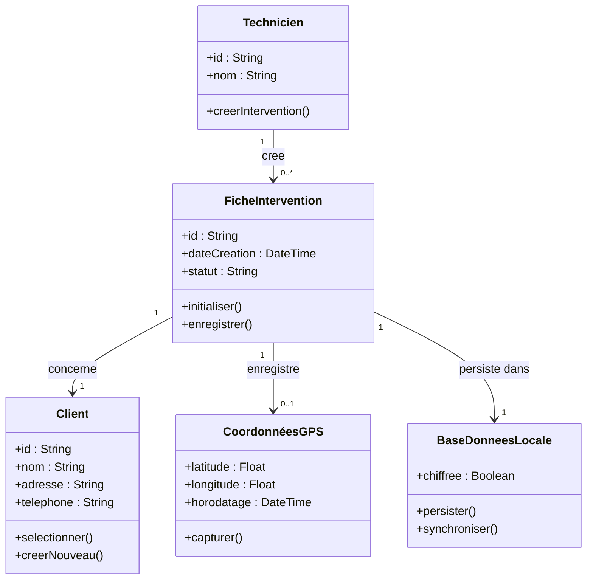

_Figure 2 : Diagramme de classes candidates du cas d'utilisation Créer une intervention_

---

**Remplir le formulaire d'intervention :**

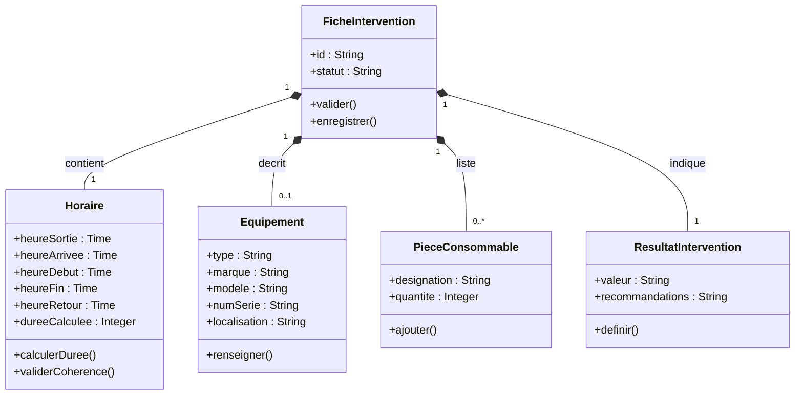

_Figure 3 : Diagramme de classes candidates du cas d'utilisation Remplir le formulaire d'intervention_

---

**Saisir une intervention sans connexion :**

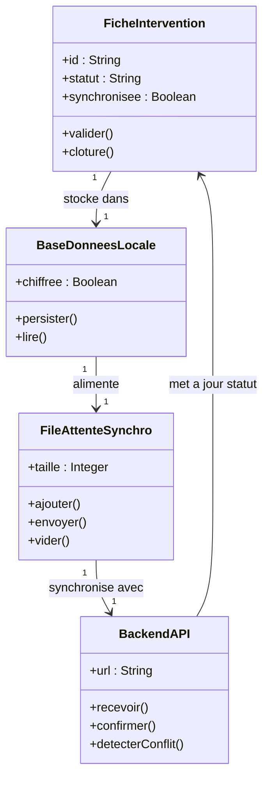

_Figure 4 : Diagramme de classes candidates du cas d'utilisation Saisir une intervention sans connexion_

---

**Photographier :**

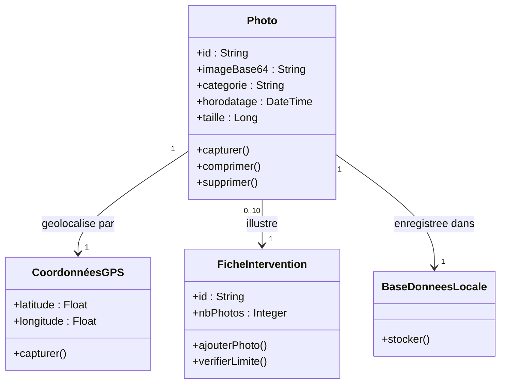

_Figure 5 : Diagramme de classes candidates du cas d'utilisation Photographier_

---

**Signer :**

```mermaid
classDiagram
    class FicheIntervention {
        +id : String
        +statut : String
        +mettreAJourStatut()
        +declencherGenerationPDF()
    }
    class Signature {
        +id : String
        +imageBase64 : String
        +type : String
        +horodatage : DateTime
        +signataire : String
        +enregistrer()
        +valider()
    }
    class ZoneSignature {
        +type : String
        +statut : String
        +afficher()
        +activer()
    }
    class Manager {
        +id : String
        +nom : String
        +signerADistance()
    }
    class ClientSite {
        +nom : String
        +signer()
        +refuser()
    }

    FicheIntervention "1" *-- "1..3" Signature : validee par
    Signature "1" --> "1" ZoneSignature : apposee dans
    Manager --> Signature : appose
    ClientSite --> Signature : appose
```

_Figure 6 : Diagramme de classes candidates du cas d'utilisation Signer_

---

**Télécharger le rapport PDF :**

```mermaid
classDiagram
    class FicheIntervention {
        +id : String
        +statut : String
        +fournirDonnees()
    }
    class RapportPDF {
        +id : String
        +url : String
        +dateGeneration : DateTime
        +taille : Long
        +generer()
        +telecharger()
        +regenerer()
    }
    class MoteurPDF {
        +assembler()
        +stocker()
        +notifier()
    }
    class QRCode {
        +url : String
        +donnees : String
        +generer()
    }
    class Notification {
        +message : String
        +canal : String
        +envoyer()
    }

    FicheIntervention "1" --> "0..1" RapportPDF : genere
    MoteurPDF --> RapportPDF : produit
    RapportPDF "1" *-- "1" QRCode : contient
    RapportPDF "1" --> "1" Notification : declenche
```

_Figure 7 : Diagramme de classes candidates du cas d'utilisation Télécharger le rapport PDF_

---

**Envoyer le rapport par email :**

```mermaid
classDiagram
    class RapportPDF {
        +url : String
        +obtenir()
    }
    class EnvoiEmail {
        +destinataires : String
        +objet : String
        +preRemplir()
        +envoyer()
    }
    class ServiceSMTP {
        +url : String
        +acheminer()
        +confirmer()
    }
    class HistoriqueEnvoi {
        +dateEnvoi : DateTime
        +canal : String
        +statut : String
        +consigner()
    }

    RapportPDF "1" --> "1" EnvoiEmail : joint a
    EnvoiEmail "1" --> "1" ServiceSMTP : transmis via
    ServiceSMTP "1" --> "1" HistoriqueEnvoi : confirme dans
```

_Figure 8 : Diagramme de classes candidates du cas d'utilisation Envoyer le rapport par email_

---

**Envoyer le rapport via WhatsApp :**

```mermaid
classDiagram
    class RapportPDF {
        +url : String
        +obtenir()
    }
    class LienAcces {
        +url : String
        +expiration : DateTime
        +generer()
    }
    class WhatsAppAPI {
        +numeroDestinataire : String
        +envoyer()
        +confirmer()
    }
    class HistoriqueEnvoi {
        +dateEnvoi : DateTime
        +canal : String
        +statut : String
        +consigner()
    }

    RapportPDF "1" --> "1" LienAcces : accessible via
    LienAcces "1" --> "1" WhatsAppAPI : transmis par
    WhatsAppAPI "1" --> "1" HistoriqueEnvoi : confirme dans
```

_Figure 9 : Diagramme de classes candidates du cas d'utilisation Envoyer le rapport via WhatsApp_

---

**Recevoir une alerte :**

```mermaid
classDiagram
    class Evenement {
        +type : String
        +donnees : String
        +horodatage : DateTime
        +declencher()
    }
    class Notification {
        +message : String
        +canal : String
        +dateEnvoi : DateTime
        +creer()
        +envoyer()
    }
    class ServicePush {
        +plateforme : String
        +transmettre()
    }
    class Manager {
        +id : String
        +appareilToken : String
        +recevoir()
    }

    Evenement "1" --> "1" Notification : genere
    Notification "1" --> "1" ServicePush : achemine via
    ServicePush "1" --> "1" Manager : delivre a
```

_Figure 10 : Diagramme de classes candidates du cas d'utilisation Recevoir une alerte_

---

**Consulter le tableau de bord :**

```mermaid
classDiagram
    class TableauDeBord {
        +url : String
        +dateChargement : DateTime
        +charger()
        +actualiser()
    }
    class FiltreRecherche {
        +dateDebut : Date
        +dateFin : Date
        +technicien : String
        +statut : String
        +appliquer()
        +reinitialiser()
    }
    class KPI {
        +nbInterventions : Integer
        +tempsMoyen : Integer
        +nbRetards : Integer
        +calculer()
        +afficher()
    }
    class Export {
        +format : String
        +generer()
        +telecharger()
    }

    TableauDeBord "1" --> "1" FiltreRecherche : utilise
    TableauDeBord "1" --> "1" KPI : affiche
    TableauDeBord "1" --> "1" Export : permet
```

_Figure 11 : Diagramme de classes candidates du cas d'utilisation Consulter le tableau de bord_

---

**Consulter l'historique d'un client :**

```mermaid
classDiagram
    class FicheClient {
        +id : String
        +nom : String
        +adresse : String
        +contacts : String
        +afficher()
        +rechercherIntervention()
    }
    class FicheIntervention {
        +id : String
        +date : DateTime
        +type : String
        +technicien : String
        +consulter()
    }
    class FiltreRecherche {
        +dateDebut : Date
        +dateFin : Date
        +type : String
        +technicien : String
        +appliquer()
    }
    class RapportPDF {
        +url : String
        +telecharger()
    }

    FicheClient "1" --> "0..*" FicheIntervention : regroupe
    FicheIntervention "1" --> "0..1" RapportPDF : associe a
    FiltreRecherche --> FicheIntervention : filtre
```

_Figure 12 : Diagramme de classes candidates du cas d'utilisation Consulter l'historique d'un client_

---

**Saisir les horaires :**

```mermaid
classDiagram
    class Technicien {
        +id : String
        +saisirHoraires()
    }
    class Horaire {
        +heureSortie : Time
        +heureArrivee : Time
        +heureDebut : Time
        +heureFin : Time
        +heureRetour : Time
        +dureeCalculee : Integer
        +calculerDuree()
        +validerCoherence()
        +enregistrer()
    }
    class FicheIntervention {
        +id : String
        +mettreAJourHoraire()
    }

    Technicien "1" --> "1" Horaire : renseigne
    Horaire "1" --> "1" FicheIntervention : enregistree dans
```

_Figure 13 : Diagramme de classes candidates du cas d'utilisation Saisir les horaires_

---

**Décrire l'équipement concerné :**

```mermaid
classDiagram
    class Technicien {
        +id : String
        +renseignerEquipement()
    }
    class Equipement {
        +type : String
        +marque : String
        +modele : String
        +numSerie : String
        +localisation : String
        +renseigner()
        +enregistrer()
    }
    class FicheIntervention {
        +id : String
        +mettreAJourEquipement()
    }

    Technicien "1" --> "1" Equipement : decrit
    Equipement "1" --> "1" FicheIntervention : enregistre dans
```

_Figure 14 : Diagramme de classes candidates du cas d'utilisation Décrire l'équipement concerné_

---

**Lister les pièces utilisées :**

```mermaid
classDiagram
    class Technicien {
        +id : String
        +listerPieces()
    }
    class PieceConsommable {
        +designation : String
        +quantite : Integer
        +ajouter()
        +enregistrer()
    }
    class FicheIntervention {
        +id : String
        +ajouterPiece()
    }

    Technicien "1" --> "0..*" PieceConsommable : saisit
    PieceConsommable "0..*" --> "1" FicheIntervention : listee dans
```

_Figure 15 : Diagramme de classes candidates du cas d'utilisation Lister les pièces utilisées_

---

**Indiquer le résultat :**

```mermaid
classDiagram
    class Technicien {
        +id : String
        +indiquerResultat()
    }
    class ResultatIntervention {
        +valeur : String
        +recommandations : String
        +definir()
        +enregistrer()
    }
    class FicheIntervention {
        +id : String
        +statut : String
        +mettreAJourResultat()
    }
    class OpenProjectAPI {
        +url : String
        +creerTicketSuivi()
    }

    Technicien "1" --> "1" ResultatIntervention : definit
    ResultatIntervention "1" --> "1" FicheIntervention : enregistree dans
    ResultatIntervention --> OpenProjectAPI : declenche si non resolu
```

_Figure 16 : Diagramme de classes candidates du cas d'utilisation Indiquer le résultat_

---

**Soumettre une demande d'intervention :**

```mermaid
classDiagram
    class Client {
        +id : String
        +nom : String
        +email : String
        +telephone : String
        +soumettreDemande()
    }
    class FormulairePortail {
        +nature : String
        +description : String
        +urgence : String
        +valider()
        +soumettre()
    }
    class DemandeIntervention {
        +id : String
        +statut : String
        +dateCreation : DateTime
        +creer()
    }
    class Ticket {
        +idOP : String
        +titre : String
        +priorite : String
        +statut : String
        +creer()
    }
    class OpenProjectAPI {
        +url : String
        +creerTicket()
        +confirmer()
    }

    Client "1" --> "1" FormulairePortail : remplit
    FormulairePortail "1" --> "1" DemandeIntervention : genere
    DemandeIntervention "1" --> "1" Ticket : produit
    Ticket "1" --> "1" OpenProjectAPI : synchronise avec
```

_Figure 17 : Diagramme de classes candidates du cas d'utilisation Soumettre une demande d'intervention_

---

**Affecter un technicien :**

```mermaid
classDiagram
    class Manager {
        +id : String
        +consulterTickets()
        +affecter()
    }
    class Ticket {
        +idOP : String
        +urgence : String
        +statut : String
        +mettreAJourStatut()
    }
    class Planning {
        +verifierDisponibilite()
    }
    class Technicien {
        +id : String
        +nom : String
        +recevoirNotification()
    }
    class InterventionPlanifiee {
        +id : String
        +statut : String
        +dateHeure : DateTime
        +creer()
    }

    Manager "1" --> "0..*" Ticket : consulte
    Manager "1" --> "1" Planning : verifie
    Manager "1" --> "1" Technicien : affecte
    Ticket "1" --> "1" InterventionPlanifiee : donne lieu a
    Technicien "1" --> "0..*" InterventionPlanifiee : assignee a
```

_Figure 18 : Diagramme de classes candidates du cas d'utilisation Affecter un technicien_

---

**Planifier une intervention de suivi :**

```mermaid
classDiagram
    class FicheIntervention {
        +id : String
        +resultat : String
        +cloture()
    }
    class Ticket {
        +idOP : String
        +statut : String
        +resterOuvert()
    }
    class Manager {
        +id : String
        +planifier()
    }
    class InterventionSuivi {
        +id : String
        +ticketLie : String
        +ordre : Integer
        +creer()
        +lier()
    }
    class Notification {
        +message : String
        +destinataire : String
        +envoyer()
    }

    FicheIntervention "1" --> "1" Ticket : liee a
    Manager "1" --> "1" InterventionSuivi : planifie
    InterventionSuivi "0..*" --> "1" Ticket : rattachee a
    InterventionSuivi "1" --> "1" Notification : declenche
```

_Figure 19 : Diagramme de classes candidates du cas d'utilisation Planifier une intervention de suivi_

---

## 6. Développement du modèle statique

Le développement du modèle statique vise à représenter la structure interne du système à travers les entités principales, leurs attributs, ainsi que les relations qui les lient. Cette section présente les diagrammes de classes organisés par module fonctionnel, chacun mettant en évidence les entités, associations et énumérations propres à son périmètre.

---

### 6.1 Diagramme de classes – Module Authentification

```mermaid
classDiagram
    class User {
        <<Entity>>
        -UUID id
        -String email
        -String passwordHash
        -String name
        -Role role
        -String department
        -String phone
        -Instant createdAt
        -Instant updatedAt
    }

    class Role {
        <<enumeration>>
        ADMIN
        MANAGER
        TECHNICIAN
    }

    User ..> Role : rôle
```

_Figure 20 : Diagramme de classes du module Authentification_

---

### 6.2 Diagramme de classes – Module Intervention

```mermaid
classDiagram
    class User {
        <<Entity>>
        -UUID id
        -String name
        -Role role
    }

    class Client {
        <<Entity>>
        -UUID id
        -String name
        -String email
        -String phone
        -String address
    }

    class Intervention {
        <<Entity>>
        -UUID id
        -String localId
        -Instant date
        -InterventionStatus status
        -String type
        -Integer duration
        -String problemDesc
        -String diagnosis
        -String workDone
        -String result
        -String recommendations
        -String equipmentBrand
        -String equipmentModel
        -String equipmentSerial
        -String equipmentLocation
        -Boolean billable
        -String signatureUrl
        -String openProjectTicketId
        -Instant syncedAt
        -Instant createdAt
        -Instant updatedAt
        +creer() void
        +demarrer() void
        +valider() void
    }

    class InterventionItem {
        <<Entity>>
        -UUID id
        -String name
        -int quantity
        -Instant createdAt
    }

    class InterventionStatus {
        <<enumeration>>
        PENDING
        IN_PROGRESS
        COMPLETED
        CANCELLED
    }

    User "1" --> "*" Intervention : technician
    Client "1" --> "*" Intervention : client
    Intervention "1" --> "*" InterventionItem : pièces
    Intervention ..> InterventionStatus : statut
```

_Figure 21 : Diagramme de classes du module Intervention_

---

### 6.3 Diagramme de classes – Module Géolocalisation

```mermaid
classDiagram
    class Client {
        <<Entity>>
        -UUID id
        -String name
        -Double latitude
        -Double longitude
    }

    class Intervention {
        <<Entity>>
        -UUID id
        -String problemDesc
    }

    Client "1" --> "*" Intervention : client
```

_Figure 22 : Diagramme de classes du module Géolocalisation_

---

### 6.4 Diagramme de classes – Module Photos

```mermaid
classDiagram
    class InterventionPhoto {
        <<Entity>>
        -UUID id
        -String url
        -PhotoType type
        -String localPath
        -Instant createdAt
    }

    class PhotoType {
        <<enumeration>>
        BEFORE
        AFTER
        OTHER
    }

    class Intervention {
        <<Entity>>
        -UUID id
    }

    Intervention "1" --> "*" InterventionPhoto : photos
    InterventionPhoto ..> PhotoType : type
```

_Figure 23 : Diagramme de classes du module Photos_

---

### 6.5 Diagramme de classes – Module Signatures

```mermaid
classDiagram
    class Intervention {
        <<Entity>>
        -UUID id
        -String signatureUrl
        -InterventionStatus status
        +valider() void
    }

    class User {
        <<Entity>>
        -UUID id
        -String name
        -String email
    }

    User "1" --> "*" Intervention : signée par
```

_Figure 24 : Diagramme de classes du module Signatures_

---

### 6.6 Diagramme de classes – Module Mode Hors-ligne

```mermaid
classDiagram
    class Intervention {
        <<Entity>>
        -UUID id
        -String localId
        -InterventionStatus status
        -Instant syncedAt
        -Instant createdAt
        -Instant updatedAt
        +creer() void
        +valider() void
    }

    class InterventionStatus {
        <<enumeration>>
        PENDING
        IN_PROGRESS
        COMPLETED
        CANCELLED
    }

    Intervention ..> InterventionStatus : statut
```

_Figure 25 : Diagramme de classes du module Mode Hors-ligne_

---

### 6.7 Diagramme de classes – Module Rapport PDF

```mermaid
classDiagram
    class RapportPDF {
        <<Value Object>>
        +String url
        +Instant dateGeneration
        +long taille
        +byte[] contenu
    }

    class Intervention {
        <<Entity>>
        -UUID id
        -String result
        -String recommendations
        -String signatureUrl
        -String equipmentBrand
        -String equipmentModel
        -String equipmentSerial
    }

    Intervention ..> RapportPDF : génère
```

_Figure 26 : Diagramme de classes du module Rapport PDF_

---

### 6.8 Diagramme de classes – Module Envoi du Rapport

```mermaid
classDiagram
    class Notification_ {
        <<Value Object>>
        +String destinataireId
        +String titre
        +String message
        +Canal canal
        +Instant dateEnvoi
    }

    class Canal {
        <<enumeration>>
        PUSH
        EMAIL
        BOTH
    }

    class RapportPDF {
        <<Value Object>>
        +String url
    }

    Notification_ ..> Canal : canal
    Notification_ ..> RapportPDF : piece jointe
```

_Figure 27 : Diagramme de classes du module Envoi du Rapport_

---

### 6.9 Diagramme de classes – Module Clients

```mermaid
classDiagram
    class Client {
        <<Entity>>
        -UUID id
        -String name
        -String email
        -String phone
        -String address
        -Double latitude
        -Double longitude
        -String contactName
        -String contactPhone
        -Boolean active
        -Instant createdAt
        -Instant updatedAt
    }

    class Equipment {
        <<Entity>>
        -UUID id
        -String brand
        -String model
        -String serialNumber
        -String location
        -Instant createdAt
    }

    class Intervention {
        <<Entity>>
        -UUID id
        -String type
        -Instant date
    }

    Client "1" --> "*" Equipment : équipements
    Client "1" --> "*" Intervention : interventions
```

_Figure 28 : Diagramme de classes du module Clients_

---

### 6.10 Diagramme de classes – Module Notifications

```mermaid
classDiagram
    class Notification_ {
        <<Value Object>>
        +String destinataireId
        +String titre
        +String message
        +Canal canal
        +Instant dateEnvoi
    }

    class Canal {
        <<enumeration>>
        PUSH
        EMAIL
        BOTH
    }

    class User {
        <<Entity>>
        -UUID id
        -String name
        -String email
    }

    Notification_ ..> User : destinée à
    Notification_ ..> Canal : canal
```

_Figure 29 : Diagramme de classes du module Notifications_

---

### 6.11 Diagramme de classes – Module Tableau de Bord

```mermaid
classDiagram
    class User {
        <<Entity>>
        -UUID id
        -String name
        -Role role
    }

    class Intervention {
        <<Entity>>
        -UUID id
        -InterventionStatus status
        -String type
        -Instant date
        +demarrer() void
    }

    class Client {
        <<Entity>>
        -UUID id
        -String name
        -String phone
    }

    class Ticket {
        <<Value Object>>
        +int id
        +String titre
        +String statut
        +String priorite
    }

    class InterventionStatus {
        <<enumeration>>
        PENDING
        IN_PROGRESS
        COMPLETED
        CANCELLED
    }

    class Role {
        <<enumeration>>
        ADMIN
        MANAGER
        TECHNICIAN
    }

    User "1" --> "*" Intervention : technician
    Client "1" --> "*" Intervention : client
    Intervention ..> InterventionStatus : statut
    Intervention ..> Ticket : lié à
    User ..> Role : rôle
```

_Figure 30 : Diagramme de classes du module Tableau de Bord_

---

### 6.12 Diagramme de classes – Module Planning

```mermaid
classDiagram
    class User {
        <<Entity>>
        -UUID id
        -String name
        -Role role
        -String department
    }

    class Intervention {
        <<Entity>>
        -UUID id
        -InterventionStatus status
        -Instant date
        -Integer duration
        -String type
        +creer() void
    }

    class InterventionStatus {
        <<enumeration>>
        PENDING
        IN_PROGRESS
        COMPLETED
        CANCELLED
    }

    class Role {
        <<enumeration>>
        ADMIN
        MANAGER
        TECHNICIAN
    }

    User "1" --> "*" Intervention : technician
    User ..> Role : rôle
    Intervention ..> InterventionStatus : statut
```

_Figure 31 : Diagramme de classes du module Planning_

---

### 6.13 Diagramme de classes – Module Rappels

```mermaid
classDiagram
    class Notification_ {
        <<Value Object>>
        +String destinataireId
        +String titre
        +String message
        +Canal canal
        +Instant dateEnvoi
    }

    class Canal {
        <<enumeration>>
        PUSH
        EMAIL
        BOTH
    }

    class Intervention {
        <<Entity>>
        -UUID id
        -InterventionStatus status
        -Instant date
    }

    class User {
        <<Entity>>
        -UUID id
        -String name
        -String email
    }

    Intervention ..> Notification_ : déclenche
    Notification_ ..> User : destinée à
    Notification_ ..> Canal : canal
```

_Figure 32 : Diagramme de classes du module Rappels_

---

### 6.14 Diagramme de classes – Module Portail Client & OpenProject

```mermaid
classDiagram
    class Client {
        <<Entity>>
        -UUID id
        -String name
        -String email
        -String phone
        -String contactName
        -String contactPhone
    }

    class Ticket {
        <<Value Object>>
        +int id
        +String titre
        +String statut
        +String priorite
        +String projet
    }

    class Intervention {
        <<Entity>>
        -UUID id
        -String openProjectTicketId
        -InterventionStatus status
        -String type
        -Instant date
    }

    class InterventionStatus {
        <<enumeration>>
        PENDING
        IN_PROGRESS
        COMPLETED
        CANCELLED
    }

    Client "1" --> "*" Intervention : client
    Intervention ..> Ticket : lié à
    Intervention ..> InterventionStatus : statut
```

_Figure 33 : Diagramme de classes du module Portail Client & OpenProject_

---

### 6.15 Architecture en couches

L'architecture du backend Spring Boot suit une organisation en **trois couches** (Controller → Service → Repository), chaque module fonctionnel possédant ses propres classes.

```mermaid
flowchart TD
    subgraph Couche_Présentation
        CTRL[Controllers\nREST API / GraphQL]
    end

    subgraph Couche_Métier
        SRV[Services\nLogique métier]
        DTO[DTOs\nObjets de transfert]
    end

    subgraph Couche_Persistence
        REPO[Repositories\nSpring Data JPA]
        ENT[Entities\nEntités JPA]
        DB[(PostgreSQL\nSupabase)]
    end

    subgraph Intégration_Externe
        OP[OpenProject\nAPI REST v3]
        PUSH[FCM / APNs\nPush Notifications]
        SMTP[Service Email\nSendGrid / SMTP]
        WA[WhatsApp\nBusiness API]
    end

    Client(R) --> CTRL
    CTRL --> SRV
    SRV --> REPO
    SRV --> DTO
    SRV --> OP
    SRV --> PUSH
    SRV --> SMTP
    SRV --> WA
    REPO --> ENT
    REPO --> DB
```

| Couche | Responsabilité |
|---|---|
| **Controller** | Point d'entrée REST, validation basique, délégation au service |
| **Service** | Logique métier, orchestration, transactions, appels externes |
| **Repository** | Accès aux données via Spring Data JPA, requêtes personnalisées |
| **Entity** | Mapping JPA avec le schéma PostgreSQL Supabase |

---

## 7. Développement du modèle dynamique

Le développement du modèle dynamique a pour objectif de représenter le comportement du système dans le temps, en mettant en évidence les interactions entre les acteurs et les différentes entités. À travers les diagrammes d'activité et de séquence, cette modélisation permet de décrire les enchaînements d'événements, les flux de messages et les traitements déclenchés. Elle permet de valider les scénarios d'usage identifiés en amont et de préparer la conception technique.

### 7.1 Diagrammes d'activité

Les diagrammes d'activité ci-dessous couvrent les processus métier critiques du cycle de vie d'une intervention, de la soumission de la demande par le client jusqu'à la signature et la génération du rapport.

---

**Créer une intervention :**

```mermaid
flowchart TD
    A([Début]) --> B[Le technicien appuie sur\nNouvelle Intervention]
    B --> C[Le système génère un ID unique\net horodate la fiche]
    C --> D{GPS disponible ?}
    D -- Oui --> E[Capture automatique\ndes coordonnées GPS]
    D -- Non --> F[Avertissement affiché\nSaisie manuelle possible]
    E --> G[Sélection du client]
    F --> G
    G --> H{Client existant ?}
    H -- Oui --> I[Sélection dans la liste]
    H -- Non --> J[Création d'une fiche client locale]
    I --> K[Saisie du type d'intervention\net référence ticket OpenProject]
    J --> K
    K --> L[Enregistrement automatique\nen base locale SQLite]
    L --> M[Intervention au statut PENDING]
    M --> N([Fin])
```

---

**Saisir une intervention sans connexion :**

```mermaid
flowchart TD
    A([Début]) --> B[Détection de l'absence\nde réseau]
    B --> C[Indicateur hors-ligne\naffiché en orange]
    C --> D[Saisie complète de l'intervention\nformulaire · photos · signatures]
    D --> E[Enregistrement à chaque étape\nen base locale SQLite]
    E --> F[Validation et clôture de la fiche]
    F --> G[Intervention placée en file\nd'attente de synchronisation]
    G --> H{Réseau disponible ?}
    H -- Non --> H
    H -- Oui --> I[Indicateur en ligne\naffiché en vert]
    I --> J[Envoi des données au backend\nvia SyncService]
    J --> K{Synchronisation réussie ?}
    K -- Oui --> L[Intervention marquée\ncomme synchronisée]
    K -- Non / Conflit --> M[Résolution automatique\nlast-write-wins]
    M --> J
    L --> N([Fin])
```

---

**Signer :**

```mermaid
flowchart TD
    A([Début]) --> B[Le technicien accède\nà la section Signatures]
    B --> C[Le système affiche\n3 zones de signature tactile]
    C --> D[Le client trace\nsa signature]
    D --> E{Client accepte\nde signer ?}
    E -- Non --> F[Technicien coche\nRefus de signature + motif]
    F --> G
    E -- Oui --> G[Le technicien trace\nsa propre signature]
    G --> H[Enregistrement des signatures\nen base locale au format PNG]
    H --> I[Zone de signature responsable\nen attente]
    I --> J{Signature manager\nimmédiate ou différée ?}
    J -- Immédiate --> K[Le manager s'authentifie\net signe sur site]
    J -- Différée --> L[Le manager signe\ndepuis le tableau de bord web]
    K --> M[3 signatures présentes\nIntervention au statut COMPLETED]
    L --> M
    M --> N[Génération automatique\ndu rapport PDF déclenchée]
    N --> O([Fin])
```

---

**Soumettre une demande d'intervention :**

```mermaid
flowchart TD
    A([Début]) --> B[Le client accède\nau portail via lien sécurisé]
    B --> C[Affichage du formulaire\nde demande simplifié]
    C --> D[Saisie des coordonnées,\nnature, description et urgence]
    D --> E{Champs obligatoires\nremplis ?}
    E -- Non --> F[Affichage d'erreur\nsous les champs vides]
    F --> D
    E -- Oui --> G[Validation de la soumission]
    G --> H{OpenProject\ndisponible ?}
    H -- Oui --> I[Création du ticket via API v3\nstatut Nouveau + priorité]
    H -- Non --> J[Mise en file d'attente\nretry automatique max 24h]
    J --> I
    I --> K[Email de confirmation\nau client avec N° de ticket]
    K --> L[Notification push et email\nenvoyées au manager]
    L --> M[Ticket affiché en file\nd'attente — statut Non affecté]
    M --> N([Fin])
```

---

**Télécharger le rapport PDF :**

```mermaid
flowchart TD
    A([Début]) --> B[L'intervention passe\nau statut COMPLETED]
    B --> C[PdfGeneratorService déclenché\nautomatiquement côté serveur]
    C --> D[Assemblage des éléments :\nlogo NG-STARs · données · photos\nsignatures · QR code]
    D --> E{Génération réussie\nen moins de 10 s ?}
    E -- Oui --> F[PDF stocké sur le backend]
    E -- Non --> G[Message d'erreur affiché\nNotification administrateur]
    G --> H[Relance manuelle\nbouton Régénérer]
    H --> C
    F --> I[Notification push envoyée\nau technicien et au manager]
    I --> J{Mode d'envoi choisi ?}
    J -- Email --> K[Envoi via EmailService\navec PDF en pièce jointe]
    J -- WhatsApp --> L[Envoi du lien sécurisé\nvia WhatsAppService]
    K --> M[Horodatage consigné\ndans l'historique]
    L --> M
    M --> N([Fin])
```

---

**Affecter un technicien :**

```mermaid
flowchart TD
    A([Début]) --> B[Le manager reçoit une notification\nNouveau ticket à affecter]
    B --> C[Le manager ouvre le tableau de bord\net consulte la file d'attente]
    C --> D{Tickets en attente\nd'affectation ?}
    D -- Non --> E[Aucun ticket —\nfin du processus]
    D -- Oui --> F[Le manager sélectionne un ticket\net consulte les détails]
    F --> G[Le système affiche le planning\ndes techniciens disponibles]
    G --> H{Technicien\ndisponible ?}
    H -- Non --> I[Ticket marqué En attente\nplanning complet]
    I --> G
    H -- Oui --> J[Le manager sélectionne un technicien\net confirme l'affectation]
    J --> K[Le système crée une intervention\nliée au ticket OpenProject]
    K --> L[Notification envoyée\nau technicien assigné]
    L --> M[Ticket mis à jour —\nstatut En cours dans OpenProject]
    M --> N([Fin])
```

---

**Planifier une intervention de suivi :**

```mermaid
flowchart TD
    A([Début]) --> B[Le technicien indique\nPartiellement ou Non résolu]
    B --> C[Le système détecte le problème\nnon résolu]
    C --> D[Notification au manager :\nSuivi requis pour [client]]
    D --> E[Le manager ouvre le ticket OP\net consulte l'historique]
    E --> F[Le manager sélectionne un technicien\net planifie une nouvelle intervention]
    F --> G[Le système crée une intervention de suivi\nliée au même ticket OpenProject]
    G --> H[Relation préservée :\n1 ticket → N interventions]
    H --> I[Notification envoyée\nau technicien désigné]
    I --> J([Fin])
```

---

### 7.2 Diagrammes de séquence

Les diagrammes de séquence détaillent la chronologie des échanges entre acteurs et composants système pour les scénarios critiques identifiés dans les cas d'utilisation.

---

**Créer une intervention :**

```mermaid
sequenceDiagram
    actor T as Technicien
    participant App as Application Mobile
    participant GPS as Service GPS
    participant DB as Base locale (SQLite)
    participant B as Backend API

    T->>App: Appuie sur « Nouvelle Intervention »
    App->>B: POST /api/interventions (brouillon)
    B->>App: 201 Created — ID + horodatage
    App->>GPS: Demande de géolocalisation
    alt GPS disponible
        GPS->>App: latitude, longitude, horodatage
        App->>DB: Enregistre les coordonnées
    else GPS indisponible
        App->>T: Avertissement — saisie manuelle possible
    end
    T->>App: Sélectionne le client
    T->>App: Renseigne type et référence ticket OP
    App->>DB: Persiste les données en local
    App->>T: Intervention au statut PENDING
```

---

**Saisir une intervention sans connexion :**

```mermaid
sequenceDiagram
    actor T as Technicien
    participant App as Application Mobile
    participant DB as Base locale SQLite
    participant B as Backend API

    App->>App: Détecte l'absence de réseau
    App->>T: Affiche indicateur hors-ligne (orange)
    T->>App: Crée et remplit l'intervention\n(formulaire, photos, signatures)
    App->>DB: Persiste chaque saisie localement
    T->>App: Valide et clôture l'intervention
    App->>DB: Ajoute à la file d'attente SyncService
    Note over App,B: En attente du retour de la connectivité
    App->>App: Détecte le retour du réseau
    App->>T: Affiche indicateur en ligne (vert)
    App->>B: Envoi des interventions en file d'attente
    alt Synchronisation réussie
        B->>App: 200 OK — confirmation
        App->>DB: Marque l'intervention synchronisée
        App->>T: Confirmation à l'écran
    else Conflit détecté
        B->>App: 409 Conflict
        App->>App: Résolution last-write-wins
        App->>B: Renvoi de l'intervention résolue
    end
```

---

**Signer :**

```mermaid
sequenceDiagram
    actor T as Technicien
    actor CS as Client sur site
    actor MG as Manager
    participant App as Application Mobile
    participant DB as Base locale
    participant B as Backend API

    T->>App: Accède à la section Signatures
    App->>T: Affiche les 3 zones de signature
    T->>CS: Tend l'appareil pour signature
    alt Client accepte
        CS->>App: Trace sa signature
        App->>DB: Enregistre signatureClient (PNG)
    else Client refuse
        T->>App: Coche « Refus de signature » + motif
    end
    T->>App: Trace sa propre signature
    App->>DB: Enregistre signatureTechnicien
    Note over App,MG: Signature responsable en attente
    MG->>B: Ouvre la fiche depuis le tableau de bord
    MG->>B: Appose signatureResponsable
    B->>DB: Enregistre la signature responsable
    B->>App: Intervention mise à jour — statut COMPLETED
    App->>B: Déclenche génération du rapport PDF
```

---

**Soumettre une demande d'intervention :**

```mermaid
sequenceDiagram
    actor C as Client
    participant P as Portail Client
    participant B as Backend API
    participant OP as OpenProject API
    actor M as Manager

    C->>P: Accède via lien sécurisé
    P->>C: Affiche le formulaire de demande
    C->>P: Remplit et valide le formulaire
    P->>B: POST /api/client-requests
    B->>OP: POST /api/v3/work_packages
    alt OpenProject disponible
        OP->>B: 201 Created — ID ticket
        B->>C: Email de confirmation + N° ticket
        B->>M: Notification push + email
    else OpenProject indisponible
        B->>B: File d'attente (retry backoff 24h max)
        B->>C: Accusé de réception différé
    end
    B->>M: Ticket affiché — statut « Non affecté »
```

---

**Affecter un technicien :**

```mermaid
sequenceDiagram
    actor M as Manager
    participant B as Backend API
    participant OP as OpenProject API
    participant APP as Application Mobile
    actor T as Technicien

    M->>B: Ouvre le tableau de bord
    B->>M: Affiche la file d'attente des tickets
    M->>B: Sélectionne un ticket
    B->>M: Affiche les détails du ticket
    M->>B: Demande le planning techniciens
    B->>M: Affiche les disponibilités
    M->>B: Confirme l'affectation (technicien + date)
    B->>OP: PATCH /api/v3/work_packages/{id} (statut = En cours)
    B->>B: Crée l'intervention liée au ticket
    B->>APP: Notification push au technicien
    APP->>T: Affiche « Nouvelle mission assignée »
```

---

**Planifier une intervention de suivi :**

```mermaid
sequenceDiagram
    actor TEC as Technicien terrain
    participant App as Application Mobile
    participant B as Backend API
    participant OP as OpenProject API
    actor M as Manager

    TEC->>App: Indique résultat = Partiellement/Non résolu
    App->>B: PUT /api/interventions/{id} (result)
    B->>B: Détecte problème non résolu
    B->>M: Notification « Suivi requis — [client] »
    M->>B: Ouvre le ticket OP
    B->>OP: GET /api/v3/work_packages/{id}
    OP->>B: Retourne historique + statut
    M->>B: Crée intervention de suivi
    B->>B: Lie la nouvelle intervention au même ticket
    B->>App: Notification nouvelle intervention planifiée
    App->>TEC: Affiche « Nouvelle intervention de suivi »
```

---

**Saisir une intervention sans connexion :**

```mermaid
flowchart TD
    A([Début]) --> B[Détection de l'absence\nde réseau]
    B --> C[Indicateur hors-ligne\naffiché en orange]
    C --> D[Saisie complète de la fiche\nformulaire · photos · signatures]
    D --> E[Enregistrement à chaque étape\nen base locale chiffrée]
    E --> F[Validation et clôture de la fiche]
    F --> G[Fiche placée en file\nd'attente de synchronisation]
    G --> H{Réseau disponible ?}
    H -- Non --> H
    H -- Oui --> I[Indicateur en ligne\naffiché en vert]
    I --> J[Envoi des données au backend\n délai max 60 secondes ]
    J --> K{Synchronisation réussie ?}
    K -- Oui --> L[Fiche marquée comme synchronisée]
    K -- Non / Conflit --> M[Résolution automatique\nlast-write-wins]
    M --> J
    L --> N([Fin])
```

---

**Télécharger le rapport PDF :**

```mermaid
flowchart TD
    A([Début]) --> B[La fiche passe\nau statut Validée]
    B --> C[Le moteur PDF est déclenché\nautomatiquement côté serveur]
    C --> D[Assemblage des éléments :\nlogo · données · photos\nsignatures · QR code]
    D --> E{Génération réussie\nen moins de 10 s ?}
    E -- Oui --> F[PDF stocké sur le backend]
    E -- Non --> G[Message d'erreur affiché\nNotification administrateur]
    G --> H[Relance manuelle\nbouton Régénérer]
    H --> C
    F --> I[Notification push envoyée\nau technicien et au manager]
    I --> J{Mode d'envoi choisi ?}
    J -- Email --> K[Envoi via service SMTP\navec PDF en pièce jointe]
    J -- WhatsApp --> L[Envoi du lien sécurisé\nvia API WhatsApp Business]
    K --> M[Horodatage consigné\ndans l'historique]
    L --> M
    M --> N([Fin])
```

---

**Soumettre une demande d'intervention :**

```mermaid
flowchart TD
    A([Début]) --> B[Le client accède\nau portail via lien sécurisé]
    B --> C[Affichage du formulaire\nde demande simplifié]
    C --> D[Saisie des coordonnées\nnature · description · urgence]
    D --> E{Champs obligatoires\nremplis ?}
    E -- Non --> F[Affichage d'erreur\nsous les champs vides]
    F --> D
    E -- Oui --> G[Validation de la soumission]
    G --> H{OpenProject\ndisponible ?}
    H -- Oui --> I[Création du ticket\nstatut Nouveau · priorité · projet]
    H -- Non --> J[Mise en file d'attente\nretry automatique max 24h]
    J --> I
    I --> K[Email de confirmation\nenvoyé au client avec N° ticket]
    K --> L[Notification push et email\nenvoyés au manager]
    L --> M[Ticket affiché en file\nd'attente — statut Non affecté]
    M --> N([Fin])
```

---

**Signer :**

```mermaid
flowchart TD
    A([Début]) --> B[Le technicien accède\nà la Section 8 — Signatures]
    B --> C[Le système affiche\n3 zones de signature tactile]
    C --> D[Le client trace\nsa signature]
    D --> E{Client accepte\nde signer ?}
    E -- Non --> F[Technicien coche\nRefus de signature + motif]
    F --> G
    E -- Oui --> G[Le technicien trace\nsa propre signature]
    G --> H[Enregistrement des signatures\nen base locale format PNG base64]
    H --> I[Zone responsable\nen attente de signature]
    I --> J{Signature manager\nimmédiate ou différée ?}
    J -- Immédiate --> K[Le manager s'authentifie\net signe sur site]
    J -- Différée --> L[Le manager signe\ndepuis le tableau de bord web]
    K --> M[3 signatures présentes\nFiche au statut Validée]
    L --> M
    M --> N[Génération automatique\ndu rapport PDF déclenchée]
    N --> O([Fin])
```

---

### 7.2 Diagramme de séquence

Le diagramme de séquence illustre la chronologie des échanges entre les différents acteurs et composants du système dans le cadre d'un scénario particulier. Il permet de représenter précisément l'ordre des messages et la coordination des interactions.

---

**Créer une intervention :**

```mermaid
sequenceDiagram
    actor T as Technicien
    participant App as Application Mobile
    participant GPS as Service GPS
    participant DB as Base locale (SQLite)
    participant B as Backend API

    T->>App: Appuie sur « Nouvelle Intervention »
    App->>B: POST /interventions — création brouillon
    B->>App: 201 Created — ID unique + horodatage
    App->>GPS: Demande de géolocalisation
    alt GPS disponible
        GPS->>App: lat / lon / horodatage
        App->>DB: Enregistre les coordonnées
    else GPS indisponible
        App->>T: Avertissement — saisie manuelle possible
    end
    T->>App: Sélectionne le client
    T->>App: Renseigne type et référence ticket
    App->>DB: Persiste les données en local
    App->>T: Fiche au statut « En cours »
```

---

**Saisir une intervention sans connexion :**

```mermaid
sequenceDiagram
    actor T as Technicien
    participant App as Application Mobile
    participant DB as Base locale chiffrée
    participant B as Backend API

    App->>App: Détecte l'absence de réseau
    App->>T: Affiche indicateur hors-ligne (orange)
    T->>App: Crée et remplit la fiche (formulaire, photos, signatures)
    App->>DB: Persiste chaque saisie localement
    T->>App: Valide et clôture la fiche
    App->>DB: Ajoute la fiche à la file d'attente
    Note over App,B: En attente du retour de la connectivité
    App->>App: Détecte le retour du réseau
    App->>T: Affiche indicateur en ligne (vert)
    App->>B: Envoi des fiches en attente (délai ≤ 60 s)
    alt Synchronisation réussie
        B->>App: 200 OK — confirmation
        App->>DB: Marque la fiche synchronisée
        App->>T: Confirmation à l'écran
    else Conflit détecté
        B->>App: 409 Conflict
        App->>App: Résolution last-write-wins
        App->>B: Renvoi de la fiche résolue
    end
```

---

**Télécharger le rapport PDF :**

```mermaid
sequenceDiagram
    actor U as Technicien / Manager
    participant B as Backend API
    participant PDF as Moteur PDF
    participant SMTP as Service Email
    participant WA as WhatsApp API

    B->>PDF: Déclenche génération (fiche = Validée)
    PDF->>B: PDF généré en ≤ 10 s — URL de stockage
    B->>U: Notification push « Rapport PDF prêt »
    alt Envoi par email
        U->>B: POST /send-email
        B->>SMTP: Envoi avec PDF en pièce jointe
        SMTP->>B: Confirmation d'envoi
        B->>U: « Email envoyé avec succès »
    else Envoi via WhatsApp
        U->>B: POST /send-whatsapp
        B->>WA: Envoi du lien sécurisé
        WA->>B: Confirmation de transmission
        B->>U: « Message WhatsApp envoyé »
    end
    B->>B: Horodatage consigné dans l'historique
```

---

**Soumettre une demande d'intervention :**

```mermaid
sequenceDiagram
    actor C as Client
    participant P as Portail Client
    participant B as Backend API
    participant OP as OpenProject API
    actor M as Manager

    C->>P: Accède via lien sécurisé
    P->>C: Affiche le formulaire de demande
    C->>P: Remplit et valide le formulaire
    P->>B: POST /client-requests
    B->>OP: POST /api/v3/work_packages
    alt OpenProject disponible
        OP->>B: 201 Created — ID ticket
        B->>C: Email de confirmation + N° ticket
        B->>M: Notification push + email
    else OpenProject indisponible
        B->>B: Mise en file d'attente (retry backoff)
        B->>C: Accusé de réception différé
    end
    B->>M: Ticket affiché — statut « Non affecté »
```

---

**Signer :**

```mermaid
sequenceDiagram
    actor T as Technicien
    actor CS as Client sur site
    actor MG as Manager
    participant App as Application Mobile
    participant DB as Base locale
    participant B as Backend API

    T->>App: Accède à la Section 8 — Signatures
    App->>T: Affiche les 3 zones de signature
    T->>CS: Tend l'appareil pour signature
    alt Client accepte
        CS->>App: Trace sa signature
        App->>DB: Enregistre signature client (PNG base64)
    else Client refuse
        T->>App: Coche « Refus de signature » + motif
    end
    T->>App: Trace sa propre signature
    App->>DB: Enregistre signature technicien
    Note over App,MG: Signature responsable en attente
    MG->>B: Ouvre la fiche depuis le tableau de bord
    MG->>B: Appose sa signature
    B->>DB: Enregistre signature responsable
    B->>App: Fiche mise à jour — statut « Validée »
    App->>B: Déclenche génération automatique du rapport PDF
```


## Conclusion

La définition claire et structurée des besoins fonctionnels constitue une base essentielle pour assurer la réussite du projet NG-Fields. Ce document a permis d'identifier les fonctionnalités attendues du système, les acteurs impliqués ainsi que les principales interactions à prendre en compte. À travers les diagrammes de cas d'utilisation, les descriptions textuelles, les classes candidates, le modèle statique et le modèle dynamique, l'ensemble du comportement du système a été formalisé de manière progressive et cohérente.

Toute évolution future des besoins ou du périmètre fonctionnel devra faire l'objet d'une mise à jour formelle de ce document, afin de garantir la cohérence et l'adéquation du système avec les objectifs fixés par NG-STARs.